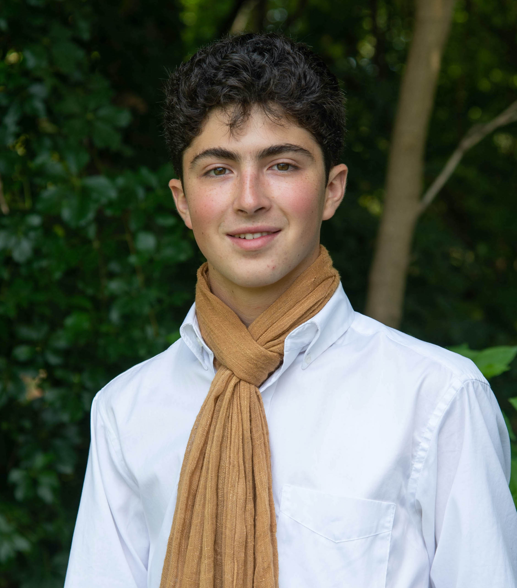

.. ECE 5160: Fast Robots documentation master file, created by
   sphinx-quickstart on Tue Jan 21 22:46:55 2025.
   You can adapt this file completely to your liking, but it should at least
   contain the root `toctree` directive.

ECE 5160: Fast Robots
==========================================================================

.. toctree::
   :maxdepth: 1
   :caption: Lab Write-Ups:

   lab1
   lab2
   lab3
   lab4
   lab5
   lab6
   lab7
   lab8
   lab9

About Me
--------------------------------------------------------------------------

|

Hi! My name's Aidan McNay (`acm289 <mailto:acm289@cornell.edu>`_), and I'm
currently a M.Eng. student at Cornell University enrolled in ECE 5160:
Fast Robots. I'm looking forward to being able to connect my previous
experiences in programming and microcontrollers to real-world applications
and interactions.