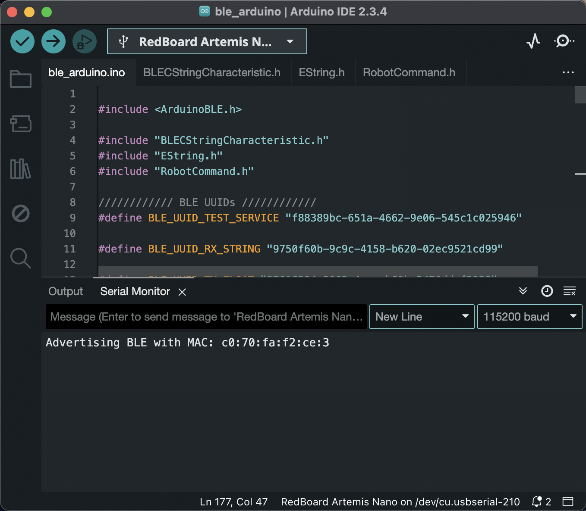
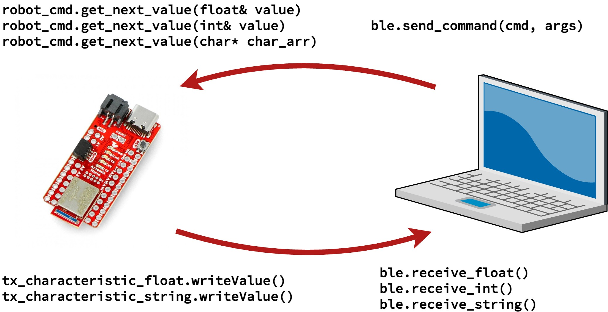
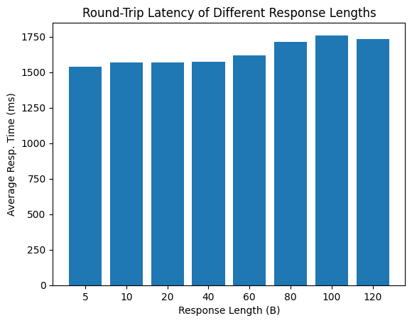
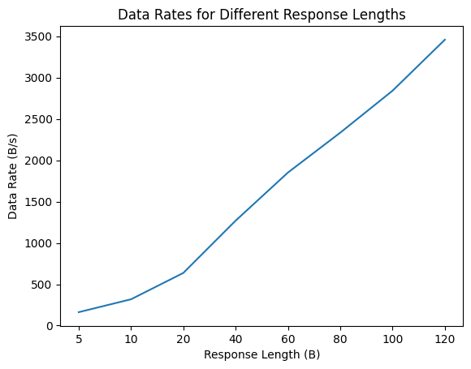

..
  ECE 5160 Lab 1 Write-Up: The Artemis Board and Bluetooth

Lab 1: The Artemis Board and Bluetooth
==========================================================================

This lab focused on getting acquainted with the
`RedBoard Artemis Nano <https://www.sparkfun.com/sparkfun-redboard-artemis-nano.html>`_,
including the Arduino IDE and Bluetooth communication.

.. raw:: html

  

Lab 1A
--------------------------------------------------------------------------

Blink
^^^^^^^^^^^^^^^^^^^^^^^^^^^^^^^^^^^^^^^^^^^^^^^^^^^^^^^^^^^^^^^^^^^^^^^^^^

We started with the example "Blink"
program (blinking the on-board LED), to ensure that basic
programming could occur.

.. youtube:: AvO1AA2BEk8
  :align: center
  :width: 70%

Serial
^^^^^^^^^^^^^^^^^^^^^^^^^^^^^^^^^^^^^^^^^^^^^^^^^^^^^^^^^^^^^^^^^^^^^^^^^^

Once basic programmability was established, the "Serial" example
showed that data could be communicated to and from the board using a
serial monitor (with the input data echoed as output).

.. youtube:: BDoguEoJ3Zg
  :align: center
  :width: 70%

Temperature & Microphone
^^^^^^^^^^^^^^^^^^^^^^^^^^^^^^^^^^^^^^^^^^^^^^^^^^^^^^^^^^^^^^^^^^^^^^^^^^

The "Analog Read" example
showed that data could be received from sensors (in this case,
the temperature sensor). In addition, the "Microphone" example showed that
we could access and manipulate microphone data to collect frequency
information.

.. youtube:: yLlPOWaOOhA
  :align: center
  :width: 70%

C Detector *(ECE 5160)*
^^^^^^^^^^^^^^^^^^^^^^^^^^^^^^^^^^^^^^^^^^^^^^^^^^^^^^^^^^^^^^^^^^^^^^^^^^

As an added example for ECE 5160, we were responsible for combining the
previous examples to detect when a "C" was played, indicated by
blinking the LED.

For detecting a "C", I modified the microphone example to output a
boolean for whether the detected loudest frequency was our expected
frequency (I used 523Hz, corresponding to ~C5), within a given margin to
account for slight variations and the relatively broad FFT bins of
~11.44Hz, as used by the PDM example.

.. code-block:: c++

  #define FREQ_MARGIN 20
  #define FREQ 523
  
  bool is_c_note(void) {
    uint32_t ui32LoudestFrequency;
  
    // ... Microphone data and FFT parsing code, adapted from
    //     the "Microphone" example ...

    return (ui32LoudestFrequency - FREQ_MARGIN) < FREQ &
           (ui32LoudestFrequency + FREQ_MARGIN) > FREQ;
  }

This was used to modify the "Blink" example, such that the ``loop``
function checked whether a C was currently being played, and only
blinked the LED if ``is_c_note`` returned ``true``.

.. youtube:: 8Tiug56DFzs
  :align: center
  :width: 70%

.. raw:: html

  

Lab 1B
--------------------------------------------------------------------------

Prelab
^^^^^^^^^^^^^^^^^^^^^^^^^^^^^^^^^^^^^^^^^^^^^^^^^^^^^^^^^^^^^^^^^^^^^^^^^^

For this section of the lab, we explored communicating with the Artemis
board over Bluetooth (specifically, "Low Energy" Bluetooth, or **BLE**),
making use of the ``ArduinoBLE`` library, and interfacing from our own
machine with the `bleak <https://bleak.readthedocs.io/en/latest/>`_
Python module. This required setting up a custom Python virtual
environment, as specified in the lab handout (including installing
the necessary modules)

.. code-block:: bash

   python3 -m venv FastRobots_ble
   source FastRobots_ble/bin/activate # Run again to re-source environment
   pip install numpy pyyaml colorama nest_asyncio bleak jupyterlab

To prepare for communication over Bluetooth, we first needed to be able to
identify our particular Bluetooth device (i.e. the Artemis board) using
it's **MAC Address**, a unique 12-digit hexadecimal number for each
device on a network. The provided ``ble_arduino.ino`` displays this
using the serial monitor when the device first starts up, which can
be replaced in ``connections.yaml`` to connect to the correct device:

In addition, we need to establish the UUID that our device's Bluetooth
service connects with; we can obtain a sample UUID (v4) from Python with:

.. code-block:: python

  from uuid import uuid4
  uuid4()

After modifying ``connections.yaml`` (Python-side) and ``ble_arduino.ino``
(Arduino-side), we can connect over Bluetooth (specifically,
Low-Energy Bluetooth, or **BLE**)! Our libraries
contain helper functions to facilitate this communication:

Lab Tasks
^^^^^^^^^^^^^^^^^^^^^^^^^^^^^^^^^^^^^^^^^^^^^^^^^^^^^^^^^^^^^^^^^^^^^^^^^^

1. Echo
""""""""""""""""""""""""""""""""""""""""""""""""""""""""""""""""""""""""""

The ``ECHO`` command receives a string from Python, and returns a modified
string. For ease of debugging and
visibility, the modified string is also printed serially.

.. code-block:: c++
   :caption: Case Statement for ``ECHO``

   case ECHO:
 
       char char_arr[MAX_MSG_SIZE];
 
       // Extract the next value from the command string as a character array
       success = robot_cmd.get_next_value(char_arr);
       if (!success) return;
 
       tx_estring_value.clear();
       tx_estring_value.append("Robot says -> ");
       tx_estring_value.append(char_arr);
       tx_estring_value.append(" :)");
       tx_characteristic_string.writeValue(tx_estring_value.c_str());
 
       Serial.printf("Sent back: '%s'\n", tx_estring_value.c_str());

       break;

.. youtube:: HRcSZi3e92M
  :align: center
  :width: 70%

2. Send Three Floats
""""""""""""""""""""""""""""""""""""""""""""""""""""""""""""""""""""""""""

The ``SEND_THREE_FLOATS`` command is similar to ``ECHO``, but changes the
received data; instead of extracting one string argument, we extract
three float arguments.

.. code-block:: c++
   :caption: Case Statement for ``SEND_THREE_FLOATS``

   case SEND_THREE_FLOATS:
      float float_a, float_b, float_c;

      // Extract the next value from the command string as an integer
      success = robot_cmd.get_next_value(float_a);
      if (!success) return;

      // Extract the next value from the command string as an integer
      success = robot_cmd.get_next_value(float_b);
      if (!success) return;

      // Extract the next value from the command string as an integer
      success = robot_cmd.get_next_value(float_c);
      if (!success) return;

      Serial.print("Three Floats: ");
      Serial.print(float_a);
      Serial.print(", ");
      Serial.print(float_b);
      Serial.print(", ");
      Serial.println(float_c);

      break;

.. youtube:: n72CCCsn2Mw
  :align: center
  :width: 70%

3. Get Time Millis
""""""""""""""""""""""""""""""""""""""""""""""""""""""""""""""""""""""""""

``GET_TIME_MILLIS`` is also similar to ``ECHO``; however, we respond with
a modified string of the current time in the format ``T:123456``
(obtained from ``millis()``)

.. code-block:: c++
   :caption: Case Statement for ``GET_TIME_MILLIS``

   case GET_TIME_MILLIS:
      tx_estring_value.clear();
      tx_estring_value.append("T:");
      tx_estring_value.append((int)millis());
      tx_characteristic_string.writeValue(tx_estring_value.c_str());
      break;

.. youtube:: -VcE4ZnJDTE
  :align: center
  :width: 70%

4. Notification Handler
""""""""""""""""""""""""""""""""""""""""""""""""""""""""""""""""""""""""""

Parsing data in Python was done using a *notification handler* to
get the time from the response string:

.. code-block:: python
   :caption: Notification handler to record the time response

   times = []

   def parse_time(response: str) -> int:
     time = int(response[2:])
     return time

   def time_handler(_uid, response):
     print(f"[time_handler] Received {response}")
     times.append(parse_time(response))

5. Time Notification Loop
""""""""""""""""""""""""""""""""""""""""""""""""""""""""""""""""""""""""""

We can attach this notification handler to the BLE Controller, and
run ``GET_TIME_MILLIS`` many times to measure inter-response latency:

.. code-block:: python

   ENTRIES_TO_RECORD = 100 # Record one more than this to get the time differences

   ble.start_notify(ble.uuid['RX_STRING'], time_handler)

   for _ in range(ENTRIES_TO_RECORD + 1):
     ble.send_command(CMD.GET_TIME_MILLIS, "")

.. youtube:: u2nMbHKI9i8
  :align: center
  :width: 70%

6. Send Times in Batch
""""""""""""""""""""""""""""""""""""""""""""""""""""""""""""""""""""""""""

As a variation, a loop was implemented on the
Artemis instead of the Python code. Here, ``NOTE_TIME_MILLIS``
notes down times in a loop, and then ``SEND_TIME_DATA`` sends
all of the values back:

.. code-block:: c++
   :caption: Case Statements for ``NOTE_TIME_MILLIS`` and ``SEND_TIME_DATA``

    case NOTE_TIME_MILLIS:
      for (int i = 0; i <= ENTRIES_TO_RECORD; i++) {
        if (entry_idx < NUM_ENTRIES) {
          time_entries[entry_idx] = millis();
          entry_idx += 1;
        }
      }
      break;

    case SEND_TIME_DATA:
      for (int i = 0; i <= ENTRIES_TO_RECORD; i++) {
        tx_estring_value.clear();
        tx_estring_value.append("T:");
        tx_estring_value.append((int)time_entries[i]);
        tx_characteristic_string.writeValue(tx_estring_value.c_str());
      }
      entry_idx = 0;
      break;

.. youtube:: 3DmgLVq0rDA
  :align: center
  :width: 70%

7. Send Temperature in Batch
""""""""""""""""""""""""""""""""""""""""""""""""""""""""""""""""""""""""""

Another loop implementation records
both time *and* temperature in a loop on the Artemis. ``NOTE_TEMP_READING``
notes the temperature with an accompanying timestamp, and ``GET_TEMP_READINGS``
sends them all back in a loop.

.. code-block:: c++
   :caption: Case Statements for ``NOTE_TIME_MILLIS`` and ``SEND_TIME_DATA``

    case NOTE_TEMP_READING:
      for (int i = 0; i <= ENTRIES_TO_RECORD; i++) {
        if (entry_idx < NUM_ENTRIES) {
          time_entries[entry_idx] = millis();
          temp_entries[entry_idx] = getTempDegF();
          entry_idx += 1;
        }
      }
      break;

    case GET_TEMP_READINGS:
      for (int i = 0; i <= ENTRIES_TO_RECORD; i++) {
        tx_estring_value.clear();
        tx_estring_value.append("T:");
        tx_estring_value.append((int)time_entries[i]);
        tx_estring_value.append("|D:");
        tx_estring_value.append(temp_entries[i]);
        tx_characteristic_string.writeValue(tx_estring_value.c_str());
      }
      entry_idx = 0;
      break;

This also required a new handler in Python to parse the
sent data (in the form ``T:123456|D:72.00``)

.. code-block:: python

   times = []
   temps = []

   def parse_time_temp(response: str) -> tuple[int, float]:
     resps = response.split("|")
     time_resp, temp_resp = resps[0], resps[1]
     return int(time_resp[2:]), float(temp_resp[2:])

   def time_temp_handler(_uid, response):
     print(f"[time_temp_handler] Received {response}")
     time, temp = parse_time_temp(response.decode("utf-8"))
     times.append(time)
     temps.append(temp)

.. youtube:: FWQ30AYyhMA
  :align: center
  :width: 70%

8. Discussion
""""""""""""""""""""""""""""""""""""""""""""""""""""""""""""""""""""""""""

From above, we have two methods to gather and store data; either
incrementally with ``GET_TIME_MILLIS``, or in batches with the note and send
data commands. Each of these has their advantages and disadvantes:

 * **Latency**: Using ``GET_TIME_MILLIS`` results in significant delay
   between readings due to BLE communication.
   In constrast, recording data in batches loops on the Artemis, avoiding
   BLE latency and resulting in much faster iterations.
 * **Feedback**: Using ``GET_TIME_MILLIS``
   results in immediate feedback from sensors, which may be useful for debugging. 
   In comparison, recording data
   in batches and then sending causes more delay between the initial request
   and when data is received.
 * **Storage**: Using ``GET_TIME_MILLIS`` results in small, temporary
   storage requirements to obtain and immediately send the data. However,
   sending data in batches means that all data must first be stored,
   posing a significant storage requirement. A rough upper
   limit is given by the 384kB of RAM; if we store just time (4B per reading),
   we get a maximum of **98,304 readings**. If we store both time and temperature,
   this is halved to **49,152 readings**. If storage becomes an issue for an
   application, batch recordings may have to be repeated (with the previous
   data overwritten), or the frequency of sampling artificially slowed to
   cover a greater time period.

9. Effective Data Rate and Overhead *(ECE 5160)*
""""""""""""""""""""""""""""""""""""""""""""""""""""""""""""""""""""""""""

5160 students experimented with response latency with
different lengths of responses. This was
implemented by having ``GET_BYTES`` send a specified number of bytes
(implemented as a string of one less than the requested length, to account
for the null terminator). 50 responses were sent for each command, to
amortize other latency.

.. code-block:: c++
   :caption: Case Statements for ``GET_BYTES``

    case GET_BYTES:
      int num_bytes;
      success = robot_cmd.get_next_value(num_bytes);
      if (!success) return;

      tx_estring_value.set_byte_len(num_bytes, 'A');
      for (int i = 0; i < NUM_TO_SEND; i++) {
        tx_characteristic_string.writeValue(tx_estring_value.c_str());
      }
      break;

|pic1| |pic2|

We can see that latency overall increased with
response length, but didn't vary significantly (dominated by BLE latency,
not the length of the response packet). This
naturally led to longer responses achieving an overall greater data rate.

.. youtube:: HTAylWNXwls
  :align: center
  :width: 70%

10. Reliability *(ECE 5160)*
""""""""""""""""""""""""""""""""""""""""""""""""""""""""""""""""""""""""""

Building on the previous example, ``GET_IDX_BYTES``
is similar to ``GET_BYTES``, but each
response is a character with the ASCII value offset by the index. This
sacrifices some (small) speed in response for the ability to discern the
expected index of each response. After receiving these on the Python
side, and verifying each response based on the index, no responses
were found to be lost, regardless of the data rate.

.. youtube:: OybWHt3fZZw
  :align: center
  :width: 70%

.. raw:: html

  

Discussion
--------------------------------------------------------------------------

Learning more about how Bluetooth communication can be implemented with
the course libraries will quickly become valuable when needing to
communicate with the robot in future labs. In addition, examining the
implementation differences and tradeoffs with variations in data
gathering patterns and response length will help inform future
implementations to best use available resources (including communication
time).