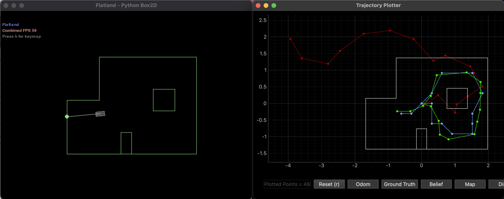

.. ECE 5160 Lab 10 Write-Up: Localization (Real)

Lab 11: Localization (Real)
==========================================================================

Now that we have our Bayes filter, we can combine this with our
measurement-gathering routine from Lab 9 to localize our robot in the
real maze

Where We Left Off...
--------------------------------------------------------------------------

Previously in Lab 10, we wrote the Bayes filter to localize with noisy
measurement data. We can run a staff-provided version of this in Lab 11
(``lab11_sim.ipynb``) to verify that our code works. The only modification
I made compared to Lab 10 was to change the configuration file,
``world.yaml``, to expect 24 evenly-spaced measurements; this matches Lab
9, and the increased data should hopefully help the robot localize better

We can see that, despite the incorrect odometry model (red), our belief
(blue) is reasonably close to the ground truth (green).

Data Communication
--------------------------------------------------------------------------

The high-level data collection FSM from Lab 9 still works for this lab,
and is a great starting point. However, one modification needed is for
the data communication; instead of being able to visually wait until the
robot is done to transfer data, we now need to be able to actively notify
Python when data is collected, so that it can be done as part of the
``update_step`` function of our ``Localizer`` in Python. To do this, the
FSM now writes "done" to the characteristic string when it transitions
back to the ``IDLE`` state:

.. code-block:: c++

   // In our state transition logic - see Lab 9
    case WAIT:
      if ( tofs.sensor1.checkForDataReady() ) {
        data_points[num_points++] = tofs.sensor1.getDistance();
        if ( num_points < 5 ) {
          curr_state = START;
        }
        else {
          int avg_distance =
              ( data_points[0] + data_points[1] + data_points[2] +
                data_points[3] + data_points[4] ) /
              5;
          log_map_data( curr_time, dmp.yaw().angle, avg_distance );
          num_measurements++;
          if ( num_measurements < 24 ) {
            pid.set_setpoint( pid.get_setpoint() - 15 );
            curr_state = PID;
          }
          else {
            stop_pid();
            tx_estring_value.clear();
            tx_estring_value.append( "done" );
            tx_characteristic_string.writeValue( tx_estring_value.c_str() );
            curr_state = IDLE;
          }
        }
      }
      break;

I also used this to mark when data transfer was complete, from the
``GET_ANGLE_DATA`` BLE command:

In Python, our notification handler could then detect when it saw this
value, allowing the function to continue. This allowed me to implement
the ``perform_observation_loop`` function to gather data:

* Send the ``RUN_TURN`` BLE command to start gathering data
* Use a notification handler to set ``is_done`` when the run is complete
* Wait on a coroutine ``wait_is_done`` to asynchronously wait until
  ``is_done`` was set
* Send the ``GET_ANGLE_DATA`` command to gather data
* Use a notification handler to gather all 24 data points, and set
  ``is_done`` when all are collected
* Similar to before, wait on ``wait_is_done`` until all data points
  are received
* Return the data points, factoring in the ToF sensor offset and
  unit conversions (see Lab 9)

.. admonition:: Asyncronous Functions
   :class: note

   To make it easier to wait on coroutines, I followed the guide in
   the `lab instructions <https://fastrobotscornell.github.io/FastRobots-2025/labs/Lab11.html>`_
   to implement ``perform_observation_loop`` as an asynchronous coroutine

.. code-block:: python
   :class: toggle

    async def perform_observation_loop(self, rot_vel=120):
        """Perform the observation loop behavior on the real robot, where the robot does  
        a 360 degree turn in place while collecting equidistant (in the angular space) sensor
        readings, with the first sensor reading taken at the robot's current heading. 
        The number of sensor readings depends on "observations_count"(=18) defined in world.yaml.
        
        Keyword arguments:
            rot_vel -- (Optional) Angular Velocity for loop (degrees/second)
                        Do not remove this parameter from the function definition, even if you don't use it.
        Returns:
            sensor_ranges   -- A column numpy array of the range values (meters)
            sensor_bearings -- A column numpy array of the bearings at which the sensor readings were taken (degrees)
                               The bearing values are not used in the Localization module, so you may return a empty numpy array
        """
        # Start running the turn
        self.ble.send_command(CMD.RUN_TURN, "")
        global is_done
        is_done = False
        print("Running...")

        # Wait for the turn to be done
        def resp_handler(_uid, response):
            global is_done
            resp = response.decode()
            print("Got response: ", resp)
            if resp == "done":
                is_done = True
        self.ble.start_notify(ble.uuid['RX_STRING'], resp_handler)

        async def wait_for_done():
            global is_done
            while( not is_done ):
                await asyncio.sleep(3)

        print("Waiting...")
        await wait_for_done()
        self.ble.stop_notify(ble.uuid['RX_STRING'])
        print("Done!", flush = True)

        # Get the data
        is_done = False

        data_time = []
        data_yaw = []
        data_distance = []
        data_total = []
        NUM_SAMPLES = 24
        global i
        i = 0

        def parse_angle_data( data: str ):
            data_components = data.split("|")
            time       = (float(data_components[0]) / 1000)
            yaw        = float(data_components[1]) * np.pi / 180
            distance   = float(data_components[2])
            return time, yaw, distance

        def angle_data_handler(_uid, response):
            global i
            global is_done
            time, yaw, distance = parse_angle_data(response.decode())
            data_yaw.append(yaw)
            data_distance.append(distance)
            i = i + 1
            print(f"{i * 100 / NUM_SAMPLES:.2f}% done", end = '\r')
            if i == NUM_SAMPLES:
                is_done = True

        self.ble.start_notify(ble.uuid['RX_STRING'], angle_data_handler)
        self.ble.send_command(CMD.GET_ANGLE_DATA, "")
        print("Logging...")
        await wait_for_done()
        self.ble.stop_notify(ble.uuid['RX_STRING'])
        print("Done!")

        return ((np.array(data_distance)[np.newaxis].T + 75) / 1000, np.empty([1, 1]))
