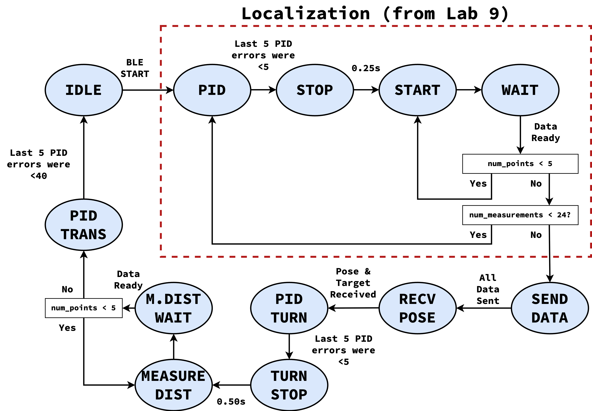

.. ECE 5160 Lab 12 Write-Up: Path Planning and Execution

Lab 12: Path Planning and Execution
==========================================================================

.. image:: img/lab12/kronk.jpg
   :align: center
   :width: 70%
   :class: bottompadding

This lab involves the synthesis of all the previous components in order
to traverse a given path around the lab, involving:

* Localizing where we are in the map (:doc:`lab9` & :doc:`lab11`)
* Moving to the next waypoint in the path, involving turning (:doc:`lab5`) and
  rotating (:doc:`lab6`) using a PID controller and position estimates (:doc:`lab7`)

My approach to solving this was to implement the full Bayes filter, where
the robot's localization data would be used to update the probability, and
the robot would be sent commands as part of the prediction step.

State Machine
--------------------------------------------------------------------------

To implement the robot-side portion of the Bayes filter, we must

* Localize first
* Send the distance data to Python (to localize)
* Receive the estimated pose and the target (expressed as a turn angle and
  translation distance)
* Use PID to first turn, then translate to the target waypoint
* Repeat for all remaining waypoints

.. admonition:: Localization
   :class: note

   Localizing after each step will significantly reduce our speed;
   however, it will increase the effective number of update steps in our
   Bayes filter, improving our accuracy in pose estimation and moving as
   close as possible to each waypoint

This is implemented as a state machine on the Artemis:

Localization Data
""""""""""""""""""""""""""""""""""""""""""""""""""""""""""""""""""""""""""

The states surrounded in the dashed red box are exactly the same as
:doc:`lab9`; they rotate the robot in a circle, and collect 24 distance
measurements at equally-spaced angles. The other states are included in
the same ``measure_step`` function used to change states in Lab 9 (in
a case statement).

The main adjustment is that we now have two PID controllers; one for
angle movement (using the parameters from Lab 6), and one for
translational movement (using the parameters from Lab 5)

.. code-block:: c++

   PID angle_pid( 1.0, 0.3, 0.5 );
   PID trans_pid( 0.10, 0.008, 0.05 );

This also means that instead of having ``run_pid_step`` from Lab 9, we
now have ``run_angle_pid_step`` and ``run_trans_pid_step``; these are
identical to before, but use the appropriate PID controller, as well
as adjusting the translational PID to settle when the last 5 measurements
are within 40mm (as opposed to 15 degrees for the angle PID), empirically
determined to be accurate enough for navigation while loose enough to let
the PID controller settle.

``SEND_DATA``
""""""""""""""""""""""""""""""""""""""""""""""""""""""""""""""""""""""""""

This is where we send the localized data back to Python (as opposed to
having Python explicitly request it). This also eliminates the need for
a "done" notification; Python knows we've collected all the data once
it's received it all.

.. code-block:: c++

   case SEND_DATA:
      // reset receive counter
      data_recv = false;
      for ( int i = 0; i < data_entry_idx; i++ ) {
        tx_estring_value.clear();
        tx_estring_value.append( data_time_entries[i] );
        tx_estring_value.append( "|" );
        tx_estring_value.append( data_yaw_entries[i] );
        tx_estring_value.append( "|" );
        tx_estring_value.append( data_distance_entries[i] );
        tx_characteristic_string.writeValue( tx_estring_value.c_str() );
        Serial.printf( "Sending data %d...\n", i );
      }
      curr_state = RECV_POSE;

``RECV_POSE``
""""""""""""""""""""""""""""""""""""""""""""""""""""""""""""""""""""""""""

``RECV_POSE`` is where we wait for Python to send us our next movement
command, which will set ``data_recv`` to ``true`` (initially set
``false`` in ``SEND_DATA``). When we receive the data, we start the
angle PID by modifying the set point by the received target angle

.. code-block:: c++

   case RECV_POSE:
      if ( data_recv ) {
        curr_state = PID_TURN;
        start_pid();
        angle_pid.set_setpoint(
            angle_no_wrap( dmp.yaw().angle - target_angle_offset ) );
      }
      break;

The BLE target ``SEND_POSE`` is used to communicate the data

.. code-block:: c++

   void   set_target( int dist, double angle_offset )
   {
     target_distance     = dist;
     target_angle_offset = angle_offset;
     data_recv           = true;
   }

   // In `handle_command`
   case SEND_POSE:
      int dist, last;
      float angle;
      success = robot_cmd.get_next_value( dist );
      if ( !success )
        return;
      success = robot_cmd.get_next_value( angle );
      if ( !success )
        return;
      set_target( dist, angle );
      break;

``PID_TURN`` and ``TURN_STOP``
""""""""""""""""""""""""""""""""""""""""""""""""""""""""""""""""""""""""""

These two states act functionally identical to ``PID`` and ``STOP`` from
the localization; we wait in ``PID_TURN`` until the targeted turn is
completed, then wait for some time in ``TURN_STOP`` to make sure we've
stopped moving before continuing (waiting a little longer than before as
a precaution for turning larger angles with more speed)

.. code-block:: c++

   case PID_TURN:
      if ( run_angle_pid_step() ) {
        stop_pid();
        stop_time        = millis();
        num_measurements = 0;
        curr_state       = TURN_STOP;
      }
      break;
   case TURN_STOP:
      if ( curr_time - stop_time > 500 ) {
        curr_state = MEASURE_DIST;
        num_points = 0;
      }
      break;

``MEASURE_DIST`` and ``MEASURE_DIST_WAIT``
""""""""""""""""""""""""""""""""""""""""""""""""""""""""""""""""""""""""""

These states are functionally identical to ``START`` and ``WAIT`` from the
localization; we start our ToF ranging in ``MEASURE_DIST``, then wait in
``MEASURE_DIST_WAIT`` for the measurement to complete. If we have fewer
than 5 measurements, we go back to ``MEASURE_DIST``; otherwise, we use
the average as our total measurement, and compute our translational PID
setpoint as our measured distance minus our target movement (to move
the target amount in total).

.. admonition:: Distance Offset
   :class: note

   An offset of ``75`` is included in the target, to account for the
   distance between our our sensor (used in distance measurement) and
   the center of the robot (what our target expects)

.. code-block:: c++

   case MEASURE_DIST:
      tofs.sensor1.startRanging();
      curr_state = MEASURE_DIST_WAIT;
      break;
   case MEASURE_DIST_WAIT:
      if ( tofs.sensor1.checkForDataReady() ) {
        data_points[num_points++] = tofs.sensor1.getDistance();
        if ( num_points < 5 ) {
          curr_state = MEASURE_DIST;
        }
        else {
          avg_distance =
              ( data_points[0] + data_points[1] + data_points[2] +
                data_points[3] + data_points[4] ) /
              5;
          // Set distance PID to avg_distance - ( target + 75 )
          trans_pid.set_setpoint( avg_distance -
                                  ( target_distance + 75 ) );
          tx_estring_value.clear();
          tx_estring_value.append( avg_distance );
          tx_estring_value.append( "|" );
          tx_estring_value.append( target_distance );
          tx_characteristic_string.writeValue( tx_estring_value.c_str() );
          if ( ( avg_distance - ( target_distance + 75 ) ) < 30 ) {
            trans_pid.set_setpoint( 30 );
          }
          start_pid();
          curr_state = PID_TRANS;
        }
      }
      break;

``PID_TRANS``
""""""""""""""""""""""""""""""""""""""""""""""""""""""""""""""""""""""""""

Finally, we wait for our translational PID to be done; this is similar to
``PID_TURN``, but uses our translational PID. We also communicate "done"
back to Python, to let it know the movement is complete.

.. code-block:: c++

   case PID_TRANS:
      if ( run_trans_pid_step() ) {
        stop_pid();
        stop_time  = millis();
        curr_state = IDLE;
        tx_estring_value.clear();
        tx_estring_value.append( "done" );
        tx_characteristic_string.writeValue( tx_estring_value.c_str() );
      }
      break;

Once in ``IDLE``, Python can command another localization with the
``RUN_TURN`` command.

Python Processing
--------------------------------------------------------------------------

On the Python side, we implement the Bayes filter with the provided data.
I was able to re-use my Lab 11 code for the update step (as the
localization FSM remained the same); however, I needed to incorporate the
prediction step to both update our prior belief, as well as command the
robot.

To do this, I had a list of the waypoints, as well as which waypoint
we were on. When predicting, I updated our current pose to reflect the
maximum likelihood estimate after updating, and the next pose as our
next waypoint (adjusting the angle of the next pose to avoid a final
unnecessary turn).

From here, I could use ``compute_control`` to determine the necessary
movements, and communicate them to the robot (in the ``RECV_POSE`` state)
to execute the motion. Finally, the prediction step waits for the motion
to be complete, as well as updates the prior belief to reflect the motion.

.. code-block:: python
   :class: toggle

   waypoints_ft = [
     (-4, -3),
     (-2, -1),
     (1, -1),
     (2, -3),
     (5, -3),
     (5, -2),
     (6, 0),
     (5, 3),
     (0, 3),
     (0, 0),
   ]
   
   waypoints = [(a / 3.28, b / 3.28) for (a, b) in waypoints_ft]
   
   curr_pose = (0, 0, 0) # Update in `prediction_step`
   next_pose = (0, 0, 0) # Update in `prediction_step`
   next_pose_idx = 1
   
   async def prediction_step():
       """ Instruct the robot to move to the next waypoint, and
       update the belief appropriately.
   
       Returns a boolean representing whether we just moved to the
       final waypoint or not.
       """
       global next_pose_idx
       global curr_pose
       global next_pose
   
       # Update the Cartesian coordinates of our next pose
       max_bel_idx = get_max(loc.bel)
       curr_pose = mapper.from_map(*max_bel_idx[0])
       next_pose = waypoints[next_pose_idx]
       next_pose_idx += 1
   
       # Compute our next pose, such that the final angle is 0
       next_pose_angle = mapper.normalize_angle(
           math.degrees(
               np.arctan2(next_pose[1]-curr_pose[1],
                          next_pose[0]-curr_pose[0]
                         )
           ) - curr_pose[2]
       )
       next_pose = (next_pose[0], next_pose[1], next_pose_angle)
   
       # Compute the control needed
       rot, trans, rot_0 = loc.compute_control(next_pose, curr_pose)
   
       # Convert units
       trans = int(trans * 1000)
       print("Sending command: " + str(trans) + "|" + str(rot))
   
       # Wait until we're done moving
       global is_done
       is_done = False
       def resp_handler(_uid, response):
           global is_done
           resp = response.decode()
           print("Got response: ", resp)
           if resp == "done":
               is_done = True
       ble.start_notify(ble.uuid['RX_STRING'], resp_handler)
   
       async def wait_for_done():
           global is_done
           while( not is_done ):
               await asyncio.sleep(3)
   
       # Send the command to our robot
       ble.send_command(CMD.SEND_POSE, str(trans) + "|" + str(rot))
   
       print("Waiting...")
       await wait_for_done()
       ble.stop_notify(ble.uuid['RX_STRING'])
       print("Done!", flush = True)
   
       # Update our probability
       loc.prediction_step(next_pose, curr_pose)
   
       # Update our pose for the next iteration
       curr_pose = next_pose
   
       return ( next_pose_idx == len(waypoints) )

This returns whether we just moved to the last waypoint, allowing our
main Bayes filter loop to know when it's done

.. code-block:: python

   # Get initial observation Data by executing a 360 degree rotation motion
   await loc.get_observation_data()
   
   # Run Update Step
   loc.update_step()
   loc.plot_update_step_data(plot_data=True)
   
   while True:
     # Run prediction and move the robot
     done = await prediction_step()
   
     # Get observation Data by executing a 360 degree rotation motion
     await loc.get_observation_data()
   
     # Run Update Step
     loc.update_step()
     loc.plot_update_step_data(plot_data=True)
   
     if done:
         break

.. admonition:: Final State
   :class: note

   The robot will start by running the initial observation loop, moving
   from ``IDLE`` and waiting in ``RECV_POSE``. The prediction step will
   provide the pose, letting the robot go from ``RECV_POSE`` all the way
   back to ``IDLE``. Since our last step is an update, the robot ends
   waiting in ``RECV_POSE``; this means we would need to reset to start
   another complete path iteration, but isn't consequential for one run

Another note is that I added a waypoint at :math:`(6, 0)` from those required;
I found that being slightly off between the two default points close to the
box obstacle could result in the robot running into it; adding another
point to move away from the box helped

Full System
--------------------------------------------------------------------------

With the above code, my robot was successfully able to navigate to or
close to all waypoints in one continuous run. Two demonstrations are
shown below; the first was slightly off in the beginning (but recovered
by being able to localize), and the superior second run was very accurate,
but required some manual adjustment when the wheels ended up rubbing
against the side of the arena. I also updated the second run to show
the predictions being mapped simultaneously, as well as localizing at
the final point.

Run 1
""""""""""""""""""""""""""""""""""""""""""""""""""""""""""""""""""""""""""

.. toggle::

   .. youtube:: 5mvE7VJtU70
      :align: center
      :width: 70%

   .. admonition:: Final Point
      :class: note

      Note that the final point isn't included in the plot, as we didn't
      update after moving. This is fixed for Run 2

   .. image:: img/lab12/run1_map.png
      :align: center
      :width: 70%
      :class: bottompadding

Run 2
""""""""""""""""""""""""""""""""""""""""""""""""""""""""""""""""""""""""""

.. toggle::

   .. youtube:: 3b51_xPog_o
      :align: center
      :width: 70%

   .. image:: img/lab12/run2_map.png
      :align: center
      :width: 70%
      :class: bottompadding