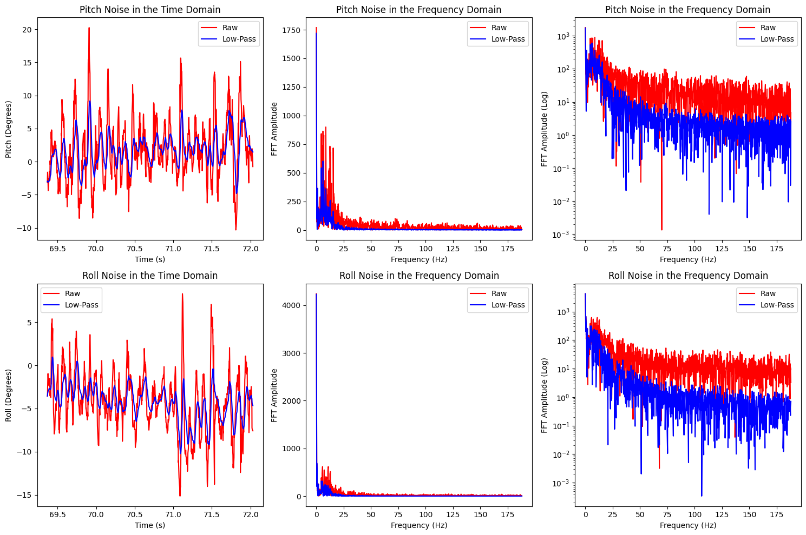
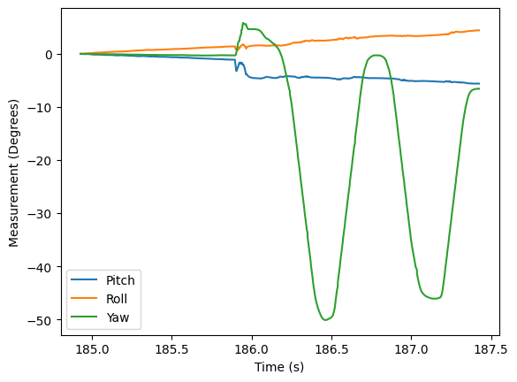

.. ECE 5160 Lab 2 Write-Up: IMU Pose Data

Lab 2: IMU Pose Data
==========================================================================

An important task in robotics is being able to sense information about
a robot's position. In this lab, we take a look at doing so with an
IMU, including using an accelerometer and gyroscope in combination.

Setup
--------------------------------------------------------------------------

Hardware setup for this lab was relatively straightforward; the IMU was
connected with a QWIIC cable to the Artemis.

.. image:: img/lab2/imu_setup.jpg
   :align: center
   :width: 50%
   :class: bottompadding image-border

After installing the appropriate library, we could demonstrate
functionality with a simple demo to read data:

 * The acceleration data showed the magnitude of acceleration in each
   direction; this reflected the Earth's gravitational pull in a
   given direction
 * The gyroscope data showed the current angular velocity in a given
   direction (0 when stationary)

.. youtube:: 5UCl10Akki4
   :align: center
   :width: 70%

.. admonition:: Significance of ``AD0_VAL``
   :class: important

   One important define is the ``AD0_VAL`` signal. This
   is the last bit of the I\ :sup:`2`\ C address for the IMU, and can be
   jumped on the IMU breakout board to change its value (allowing for
   multiple IMUs on the same I\ :sup:`2`\ C bus). Since ours isn't jumped,
   the default value of 1 is used.

Accelerometer
--------------------------------------------------------------------------

To get the IMU data, I created the command ``GET_ACCEL_CARTESIAN`` to get
the IMU's cartesian acceleration, as well as ``GET_ACCEL_ATTITUDE`` to
get the pitch and roll. These were tested by having the IMU at -90°, 0°,
and 90° for pitch and roll, and using a Python function to report the
data.

.. code-block:: c++
   :caption: Obtaining attitude data on the Artemis

   float get_pitch() {
     float x, z;
     x = myICM.accX();
     z = myICM.accZ();
   
     return atan2(x, z) * 180 / M_PI;
   }
   
   float get_roll() {
     float y, z;
     y = myICM.accY();
     z = myICM.accZ();
   
     return atan2(y, z) * 180 / M_PI;
   }

   // handle_command case statement

   case GET_ACCEL_ATTITUDE:
      // Wait for data
      while (!myICM.dataReady()) {
        delay(500);
      }
      myICM.getAGMT();

      tx_estring_value.clear();
      tx_estring_value.append((int)millis());
      tx_estring_value.append("|");
      tx_estring_value.append(get_pitch());
      tx_estring_value.append("|");
      tx_estring_value.append(get_roll());
      tx_characteristic_string.writeValue(tx_estring_value.c_str());
      break;

.. code-block:: python
   :caption: Obtaining attitude data in Python

   def parse_attitude( data: str ) -> tuple[int, float, float]:
     data_components = data.split("|")
     time = data_components[0]
     pitch = data_components[1]
     roll = data_components[2]
     return int(time), float(pitch), float(roll)
   
   ble.send_command(CMD.GET_ACCEL_ATTITUDE, "")
   data = ble.receive_string(ble.uuid['RX_STRING'])
   time, pitch, roll = parse_attitude(data)
   LOG.info(f"Received data: TIME = {time}, PITCH = {pitch:.5f}, ROLL = {roll:.5f}")

.. youtube:: dNvl3Zwqg5s
   :align: center
   :width: 70%

.. youtube:: IlTydkLRVe0
   :align: center
   :width: 70%

From here, we could perform a two-point calibration at the extreme
angles to correct any underlying bias. By measuring the raw data at known
extreme angles, and assuming the angle varied linearly, we could derive
an equation to determine the correct angle from measured data, and update
the Artemis with ``CALIBRATE``

.. code-block:: python

   # Obtain data at -90 pitch
   input("Position IMU at -90° Pitch!") # Wait until ready
   ble.send_command(CMD.GET_ACCEL_ATTITUDE, "")
   data = ble.receive_string(ble.uuid['RX_STRING'])
   _, pitch_n90, _ = parse_attitude(data)
   print(f" - Pitch obtained: {pitch_n90:.5f}")

   # ...
   # Obtain pitch_90, roll_n90, and roll_90 similarly, as
   # well as flat for reference
   # ...

   # Calculate two-point calibration for both pitch and roll
   pitch_slope  = 180 / (pitch_90 - pitch_n90)
   pitch_offset = 90 - (pitch_90 * pitch_slope)
   roll_slope   = 180 / (roll_90 - roll_n90)
   roll_offset  = 90 - (roll_90 * roll_slope)

   # true_pitch = (measured_pitch * pitch_slope) + pitch_offset
   # true_roll  = (measured_roll  * roll_slope ) + roll_offset

   # Communicate back to Artemis
   ble.send_command(CMD.CALIBRATE, 
     "{:.5f}".format(pitch_slope)  + "|" +
     "{:.5f}".format(pitch_offset) + "|" +
     "{:.5f}".format(roll_slope)   + "|" +
     "{:.5f}".format(roll_offset))

We also measured the data at 0 degrees, to see how well it mapped. While
the extremes were mapped perfectly by our equations (by design), the
middle points were still slightly off (although the overall error improved),
shown in the screenshot from Jupyter below.

.. image:: img/lab2/calibrate.png
   :align: center
   :width: 70%
   :class: bottompadding image-border

.. youtube:: 0wc5D49QIGM
   :align: center
   :width: 70%

While this helps correct the data somewhat, there was still significant
noise in the measurements. To try to eliminate this noise, I performed an
FFT of data measured for a few seconds, to see whether we could discern
data and noise by frequency (testing both when the IMU was stationary
and moving).

By first obtaining data in batch amounts with
``LOG_ACCEL_ATTITUDE_BULK``, then transmitting it all with 
``GET_ACCEL_ATTITUDE_BULK`` (similar to Lab 1), I was able to achieve
a sample rate of **~376 measurements per second.**

.. figure:: img/lab2/static_fft.png
   :align: center
   :width: 70%
   :class: image-border

   Data from the stationary IMU in both the time and frequency domains

.. figure:: img/lab2/dynamic_fft.png
   :align: center
   :width: 70%
   :class: image-border

   Data from the moving IMU in both the time and frequency domains

.. youtube:: F9UCEwOJ9cE
   :align: center
   :width: 70%

Examining these graphs, it appears as though the low-frequency data ends
around **5Hz**, at which point noise appears in the system. To eliminate
this, we can implement a low-pass filter with the following
post-processing step, to incorporate the past measurement into the
current (done for both pitch and yaw).

.. math::
  
   dt &= \frac{1}{\text{Sample Rate}} = \frac{1}{375.8 \text{ Hz}} = 0.00266 \text{ seconds}
   
   RC &= \frac{1}{2 \cdot \pi \cdot f_\text{low-pass}} = \frac{1}{2 \cdot \pi \cdot 5\text{ Hz}} = 0.032 \text{ seconds}
   
   \alpha &= \frac{dt}{dt + RC} = \frac{0.00266}{0.00266 + 0.032} = 0.077

.. code-block:: c++
   
   float alpha = 0.077; // Obtained from Python
   
   data_lp[0] = data_raw[0];
   
   for( int i = 0; i < num_samples; i++ ){
     data_lp[i]     = (      alpha  * data_raw[i]    ) + 
                      ( (1 - alpha) * data_lp[i - 1] );
     data_lp[i - 1] = data_lp[i];
   }

The collected data is low-passed with ``LOW_PASS_ATTITUDE_BULK``, and
sent over in batch with ``GET_LOW_PASS_ATTITUDE_BULK``.

   Comparison of measured and low-passed IMU data

.. youtube:: B8H_UyCgzZ8
   :align: center
   :width: 70%

We can see that the measured low-passed data is significantly smoother,
as well as having decreased noise in the higher frequencies by over an
order of magnitude.

Gyroscope
--------------------------------------------------------------------------

While our accelerometer can be noisy, we can also use a gyroscope, which
has significantly less noise. However, this does come with the downside
of having drift. We integrate measurements over time; therefore, if we
happen to sample during a particularly fast point, integrating assumes
that the gyroscope is moving that speed for the entire time step.

For 1000 samples with no delay in the sampling loop (i.e. relatively
small time steps), this doesn't result in too much drift:

However, introducing a 20 millisecond delay (increasing each time step)
can drastically increase the drift.

.. image:: img/lab2/gyro_20ms.png
   :align: center
   :width: 70%
   :class: image-border bottompadding

.. youtube:: i7_ULNrMOw0
   :align: center
   :width: 70%

This can be mitigated by combining the gyroscope and accelerometer
data (for pitch and roll, since yaw doesn't have acceleration to measure).
We can fuse both measurements using a coefficient :math:`\alpha` to
mitigate noise/drift from the accelerometer/gyroscope, respectively:

.. math::

   \theta = (\alpha)(\theta_\text{prev} + \theta_g) + (1 - \alpha)\theta_a

This yields data that has less noise and drift than either the
accelerometer or gyroscope alone (although some noise is still present
from human vibration, and some drift is present from artificially high
changes in yaw). Experimentally, I determined :math:`\alpha = 0.3`
provided a good balance.

.. image:: img/lab2/compensated.png
   :align: center
   :width: 70%
   :class: image-border bottompadding

.. youtube:: hdMvr-e8-Ok
   :align: center
   :width: 70%

Collecting Data
--------------------------------------------------------------------------

Finally, we can optimize our code's loop for data collection. This
involves collecting data in the main loop (determined by a flag
``record_data``), and simply skipping to the next iteration instead
of delaying when data isn't available.

I chose to store this data as separate arrays (instead of one large
array) to make indexing easier, as well as make it easier to debug
any particular set of data if needed in the future.

.. admonition:: Storage Size
   :class: important

   We want to store at least 5 seconds of data. To use the least size
   for each measurement, I chose to store all degree measurements as
   ``float``\ s (4B), with the time stamp as an ``int`` (4B), resulting
   in each measurement taking 16B. For our memory size of 384kB, this
   means that we could store **24576 measurements**. With our measured
   sample rate of ~355 measurements per second (slightly slower than
   before, to listen for the stop command), this allows us to capture
   data for **69 seconds** continuously.

.. code-block:: c++

   // handle_command case statement
   
   case START_RECORD_DATA:
      record_data = true;
      break;

   case STOP_RECORD_DATA:
      record_data = false;

   // Main loop

   if( record_data & (num_samples_taken < NUM_SAMPLES) & myICM.dataReady() ){
     num_data_loops++;
     myICM.getAGMT();

     curr_time = micros();
     dt = (float)(curr_time - last_time) / 1000000;
     last_time = curr_time;

     pitch_g = curr_pitch + myICM.gyrX()*dt;
     roll_g  = curr_roll + myICM.gyrY()*dt;
     yaw_g   = curr_yaw + myICM.gyrZ()*dt;

     curr_pitch = (comp_alpha * get_pitch()) + ((1 - comp_alpha) * pitch_g);
     curr_roll = (comp_alpha * get_roll()) + ((1 - comp_alpha) * roll_g);
     curr_yaw = yaw_g;

     data_time[num_samples_taken] = (int)millis();
     data_pitch[num_samples_taken] = curr_pitch;
     data_roll[num_samples_taken] = curr_roll;
     data_yaw[num_samples_taken] = curr_yaw;
     num_samples_taken++;
   }

During this time, we used ``num_data_loops`` to count the number of
iterations of the loop. This turned out to be the same as the overall
number of iterations of the main loop, indicating data was always
available.

.. youtube:: Hy4fucIr7zk
   :align: center
   :width: 70%

RC Stunt
--------------------------------------------------------------------------

Lastly, we get to meet Ned, my RC car!

.. image:: img/lab2/ned.jpg
   :align: center
   :width: 70%
   :class: image-border bottompadding

After test-driving Ned and doing some spins/flips, it's clear that he
has a good range of motion. However, the wheels do suffer from slipping,
and the motions are somewhat jerky - hopefully something we'll be able to
fix in future labs

.. youtube:: 5cjnL1Of3a8
   :align: center
   :width: 70%