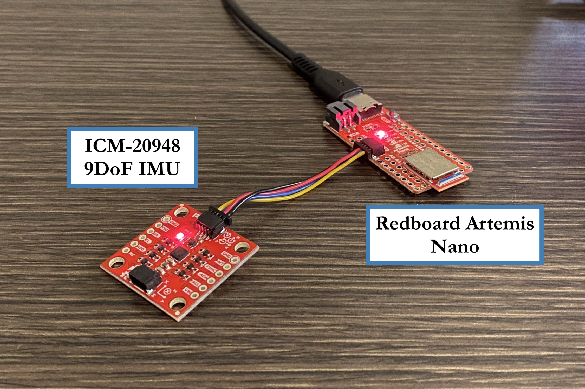
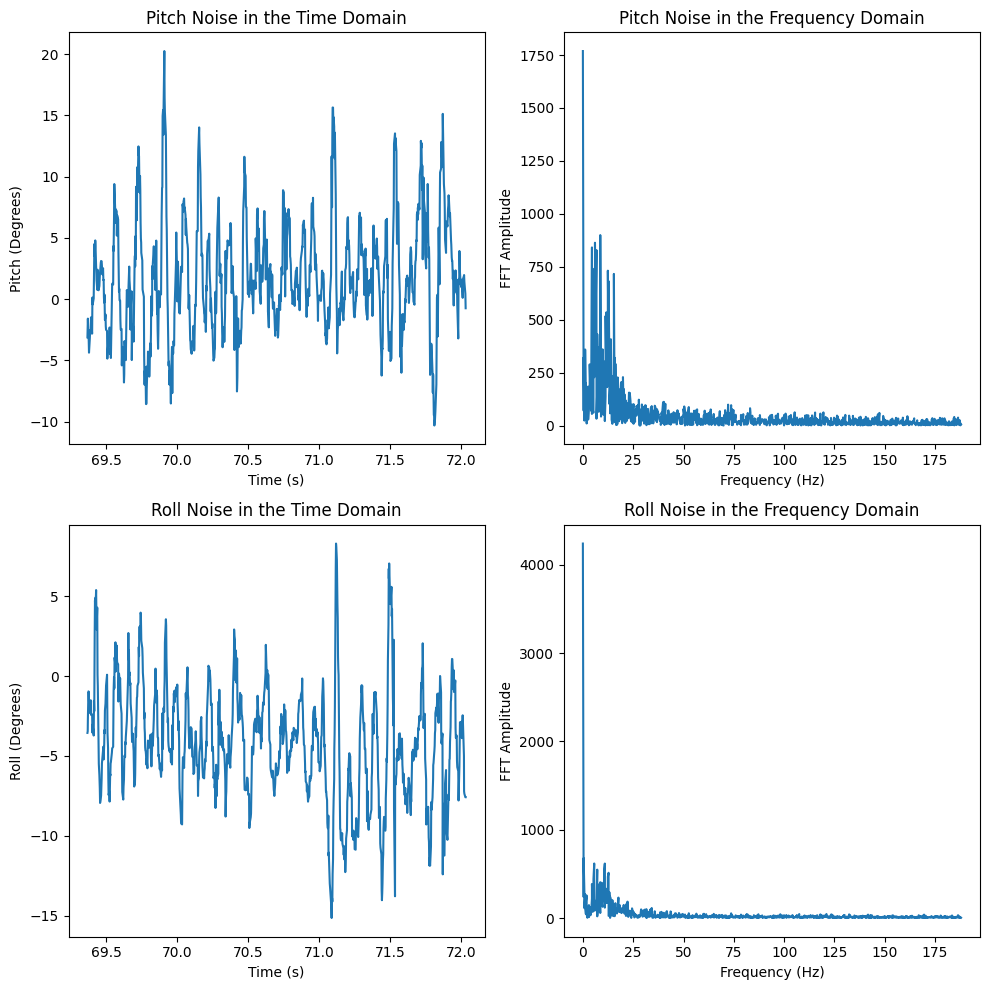

.. ECE 5160 Lab 2 Write-Up: IMU Pose Data

Lab 2: IMU Pose Data
==========================================================================

An important task in robotics is being able to sense information about
a robot's position. In this lab, we take a look at doing so with an
IMU, including using an accelerometer and gyroscope in combination.

Setup
--------------------------------------------------------------------------

Hardware setup for this lab was relatively straightforward; the IMU was
connected with a QWIIC cable to the Artemis.

After installing the appropriate library, we could demonstrate
functionality with a simple demo to read data:

 * The acceleration data showed the magnitude of acceleration in each
   direction; this reflected the Earth's gravitational pull in a
   given direction
 * The gyroscope data showed the current angular velocity in a given
   direction (0 when stationary)

.. youtube:: 5UCl10Akki4
   :align: center
   :width: 70%

.. admonition:: Significance of ``AD0_VAL``
   :class: important

   One important define is the ``AD0_VAL`` signal. This
   is the last bit of the I\ :sup:`2`\ C address for the IMU, and can be
   jumped on the IMU breakout board to change its value (allowing for
   multiple IMUs on the same I\ :sup:`2`\ C bus). Since ours isn't jumped,
   the default value of 1 is used.

Accelerometer
--------------------------------------------------------------------------

To get the IMU data, I created the command ``GET_ACCEL_CARTESIAN`` to get
the IMU's cartesian acceleration, as well as ``GET_ACCEL_ATTITUDE`` to
get the pitch and roll. These were tested by having the IMU at -90°, 0°,
and 90° for pitch and roll, and using a Python function to report the
data.

.. code-block:: python
   :caption: Obtaining attitude data in Python

   def parse_attitude( data: str ) -> tuple[int, float, float]:
     data_components = data.split("|")
     time = data_components[0]
     pitch = data_components[1]
     roll = data_components[2]
     return int(time), float(pitch), float(roll)
   
   ble.send_command(CMD.GET_ACCEL_ATTITUDE, "")
   data = ble.receive_string(ble.uuid['RX_STRING'])
   time, pitch, roll = parse_attitude(data)
   LOG.info(f"Received data: TIME = {time}, PITCH = {pitch:.5f}, ROLL = {roll:.5f}")

.. youtube:: dNvl3Zwqg5s
   :align: center
   :width: 70%

.. youtube:: IlTydkLRVe0
   :align: center
   :width: 70%

From here, we could perform a two-point calibration at the extreme
angles to correct any underlying bias. By measuring the raw data at known
extreme angles, and assuming the angle varied linearly, we could derive
an equation to determine the correct angle from measured data, and update
the Artemis with ``CALIBRATE``

.. code-block:: python

   # Obtain data at -90 pitch
   input("Position IMU at -90° Pitch!") # Wait until ready
   ble.send_command(CMD.GET_ACCEL_ATTITUDE, "")
   data = ble.receive_string(ble.uuid['RX_STRING'])
   _, pitch_n90, _ = parse_attitude(data)
   print(f" - Pitch obtained: {pitch_n90:.5f}")

   # ...
   # Obtain pitch_90, roll_n90, and roll_90 similarly
   # ...

   # Calculate two-point calibration for both pitch and roll
   pitch_slope  = 180 / (pitch_90 - pitch_n90)
   pitch_offset = 90 - (pitch_90 * pitch_slope)
   roll_slope   = 180 / (roll_90 - roll_n90)
   roll_offset  = 90 - (roll_90 * roll_slope)

   # true_pitch = (measured_pitch * pitch_slope) + pitch_offset
   # true_roll  = (measured_roll  * roll_slope ) + roll_offset

   # Communicate back to Artemis
   ble.send_command(CMD.CALIBRATE, 
     "{:.5f}".format(pitch_slope)  + "|" +
     "{:.5f}".format(pitch_offset) + "|" +
     "{:.5f}".format(roll_slope)   + "|" +
     "{:.5f}".format(roll_offset))

.. youtube:: 0wc5D49QIGM
   :align: center
   :width: 70%

While this helps correct the data somewhat, there was still significant
noise in the measurements. To try to eliminate this noise, I performed an
FFT of data measured for a few seconds, to see whether we could discern
data and noise by frequency (testing both when the IMU was stationary
and moving).

By first obtaining data in batch amounts with
``LOG_ACCEL_ATTITUDE_BULK``, then transmitting it all with 
``GET_ACCEL_ATTITUDE_BULK`` (similar to Lab 1), I was able to achieve
a sample rate of **~376 measurements per second.**

.. figure:: img/lab2/static_fft.png
   :align: center
   :width: 70%
   :class: image-border

   Data from the stationary IMU in both the time and frequency domains

   Data from the moving IMU in both the time and frequency domains

.. youtube:: F9UCEwOJ9cE
   :align: center
   :width: 70%

Examining these graphs, it appears as though the low-frequency data ends
around **5Hz**, at which point noise appears in the system. To eliminate
this, we can implement a low-pass filter with the following
post-processing step, to incorporate the past measurement into the
current (done for both pitch and yaw).

.. math::
  
   dt &= \frac{1}{\text{Sample Rate}} = \frac{1}{375.8 \text{ Hz}} = 0.00266 \text{ seconds}
   
   RC &= \frac{1}{2 \cdot \pi \cdot f_\text{low-pass}} = \frac{1}{2 \cdot \pi \cdot 5\text{ Hz}} = 0.032 \text{ seconds}
   
   \alpha &= \frac{dt}{dt + RC} = \frac{0.00266}{0.00266 + 0.032} = 0.077

.. code-block:: c++
   
   float alpha = 0.077; // Obtained from Python
   
   data_lp[0] = data_raw[0];
   
   for( int i = 0; i < num_samples; i++ ){
     data_lp[i]     = (      alpha  * data_raw[i]    ) + 
                      ( (1 - alpha) * data_lp[i - 1] );
     data_lp[i - 1] = data_lp[i];
   }

The collected data is low-passed with ``LOW_PASS_ATTITUDE_BULK``, and
sent over in batch with ``GET_LOW_PASS_ATTITUDE_BULK``.

.. figure:: img/lab2/dynamic_lp_fft.png
   :align: center
   :width: 90%
   :class: image-border

   Comparison of measured and low-passed IMU data

.. youtube:: B8H_UyCgzZ8
   :align: center
   :width: 70%

We can see that the measured low-passed data is significantly smoother,
as well as having decreased noise in the higher frequencies by over an
order of magnitude.

Gyroscope
--------------------------------------------------------------------------

While our accelerometer can be noisy, we can also use a gyroscope, which
has significantly less noise.

Collecting Data
--------------------------------------------------------------------------

RC Stunt
--------------------------------------------------------------------------