.. ECE 5160 Lab 3 Write-Up: ToF Data

Lab 3: Time-of-Flight Sensing
==========================================================================

Once we go our IMU working, we can begin to include Time-of-Flight (ToF)
data to sense other objects around us.

Prelab
--------------------------------------------------------------------------

This week's prelab included determining how our two ToF sensors (as well
as the IMU) would be wired (noting that
`blue is SDA and yellow is SCL <https://www.sparkfun.com/qwiic-cable-breadboard-jumper-4-pin.html>`_)

.. image:: img/lab3/wiring.png
   :align: center
   :width: 100%
   :class: bottompadding

.. admonition:: Battery Wire Colors
   :class: info

   The wiring colors unconventionally change from the LiPo
   battery to the Artemis; this was a result of our JST connector
   physically connecting black to the ``+`` terminal (and red to 
   ``-``), so the color convention was swapped to have correct voltage
   polarity.

All of our sensor boards communicate over I\ :sup:`2`\ C;
we can use the QWIIC breakout board to connect all of them to the Artemis'
I\ :sup:`2`\ C port, and strip/solder the QWIIC cables to our ToF sensors
as appropriate

Two Time-of-Flight Sensors
""""""""""""""""""""""""""""""""""""""""""""""""""""""""""""""""""""""""""

To detect obstacles in multiple directions, our vehicle will use two
ToF sensors. While their position may change based on future lab results,
I currently plan to have them mounted on the front and side of the car.
In a maze scenario, this will allow us to see obstacles directly in front
of us as well as to one side,
at the expense of behind us (likely not needed, as it's where we came from)
and to the other side (can be achieved by rotation).

.. image:: img/lab3/tof-placement.png
   :align: center
   :width: 40%
   :class: bottompadding

Both ToF sensors have a
default I\ :sup:`2`\ C address of ``0x52``. If we attempt to communicate,
both will see thie address as theirs and attempt to respond appropriately,
causing a bus collision. However, their address is programmable; we can
therefore use the ``XSHUT`` pin to turn off one and change the address
of the other to avoid collisions.

Finally, the ToF sensors are more position-dependent than the IMU; I
accordingly chose to use the long QWIIC cables for these to leave them
the most freedom of position on the robot.

Lab Tasks
--------------------------------------------------------------------------

One Time-of-Flight Sensor
""""""""""""""""""""""""""""""""""""""""""""""""""""""""""""""""""""""""""

The first step was to connect one ToF sensor, to verify it could work
alone.

.. figure:: img/lab3/one-tof.png
   :align: center
   :width: 70%
   :class: image-border

   Hardware setup with one ToF sensor (``XSHUT`` not necessary)

We can use the Arduino example for scanning the I\ :sup:`2`\ C
bus to verify the address.

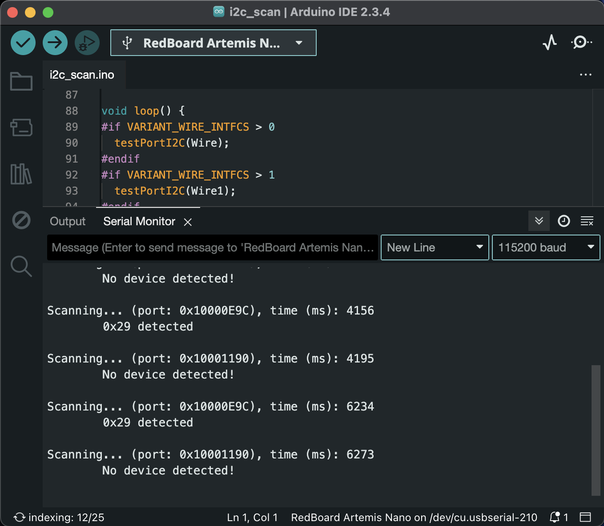

   I\ :sup:`2`\ C scanning example

The address found is ``0x29``; while
this initially seems incorrect, we can notice that this is
``0x52 >> 1``, omitting the last bit. The last I\ :sup:`2`\ C
address bit is used to indicate direction; ``0`` for a write,
``1`` for a read. Because of this, the controlling device only
keeps track of the first 7 bits.

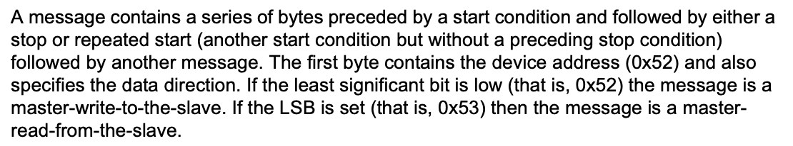

   An excerpt from the `ToF datasheet <https://cdn.sparkfun.com/assets/8/9/9/a/6/VL53L0X_DS.pdf#page=19>`_, verifying our address expectation

Testing Range
""""""""""""""""""""""""""""""""""""""""""""""""""""""""""""""""""""""""""

For this lab, I chose the "Short" distance mode, as it is the best with
ambient light, and the 1.3 meters of range seemed adequate for a robot
of our size.

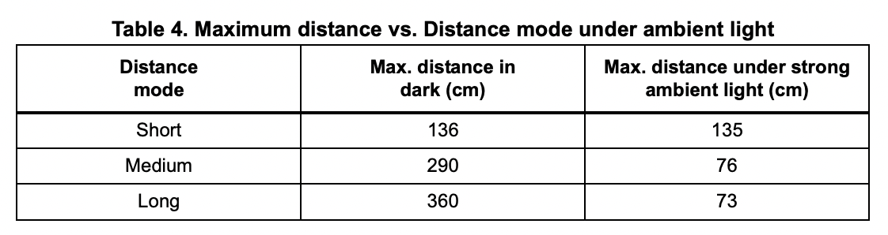

   The available distance modes (Source: `Datasheet <https://cdn.sparkfun.com/assets/8/9/9/a/6/VL53L0X_DS.pdf#page=10>`_)

.. code-block:: c++
   :caption: Initialization of the ToF Sensor

   #include "SparkFun_VL53L1X.h"

   void setup() {
   
   // ...
     Wire.begin();
   
     if (distanceSensor.begin() != 0)  // Begin returns 0 on a good init
     {
       Serial.println("Sensor failed to begin. Please check wiring. Freezing...");
       while (1);
     }
     distanceSensor.setDistanceModeShort();
     Serial.println("Sensor online!");
   }

For this experiment, I used a tape measure to get the true position, and
used the IMU over Bluetooth to record and plot measured position, as well
as ranging time.

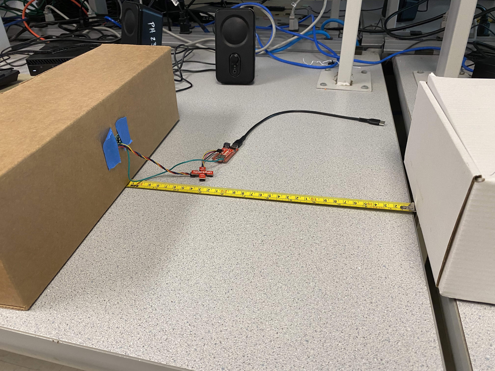

   The testing setup for the Time-of-Flight sensor

.. code-block:: c++
   :caption: ToF data loop

   for( int i = 0; i < ENTRIES_TO_RECORD; i++ ){
     unsigned long start_time = micros();
     distanceSensor.startRanging(); 
     while (!distanceSensor.checkForDataReady()) {
       delay(1);
     }
     ranging_time_entries[i] = micros() - start_time;
     distance_entries[i] = distanceSensor.getDistance();  // Get the result of the measurement from the sensor
     distanceSensor.clearInterrupt();
     distanceSensor.stopRanging();
   }

Sweeping a range of distances (incrementing by 10cm) resulted in the
following data:

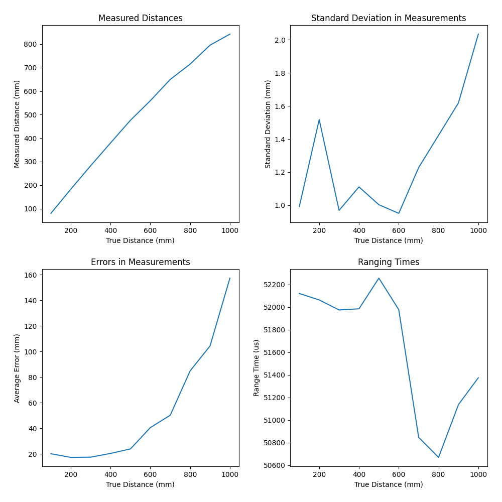

We can see that the error significantly increased with the distance
being measured. Additionally, even close by, the sensor was consistently
off by ~20mm; this could be fixed by using the ``calibrateOffset`` or
``setOffset`` functions of the sensor library. Finally, we can see that
ranging time varied a lot; while some is due to noise, some may also be
due to the sensor recognizing when it won't make a good measurement
anyway, and choosing not to spend too much time on it.

Repeating this experiment in the dark not only confirmed the measurements,
but gave confidence that our sensor was resilient to ambient light.

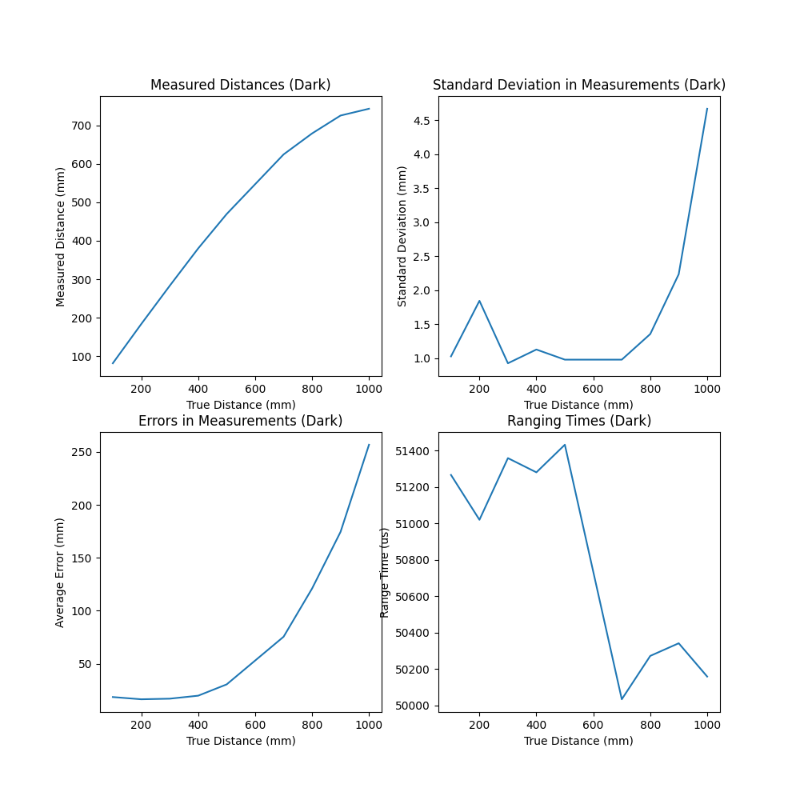

.. youtube:: VvzOgBclAFI
   :align: center
   :width: 70%

Finally, I also wanted to see what the effect of manually varying the
timing budget with ``setTimingBudgetInMs`` would do to the results.
The distance data is interesting (even decreasing at one point), but
unsuprising; I ended up using a different sensor for this, and we already
knew they were unreliable at that distance. More interesting is the
standard deviation; higher range times yielded more precise results.

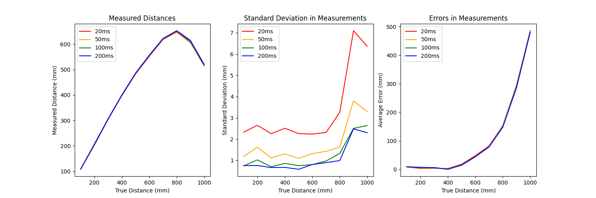

Two Time-of-Flight Sensors
""""""""""""""""""""""""""""""""""""""""""""""""""""""""""""""""""""""""""

Now that we've verified functionality with one sensor, we can add the
other!

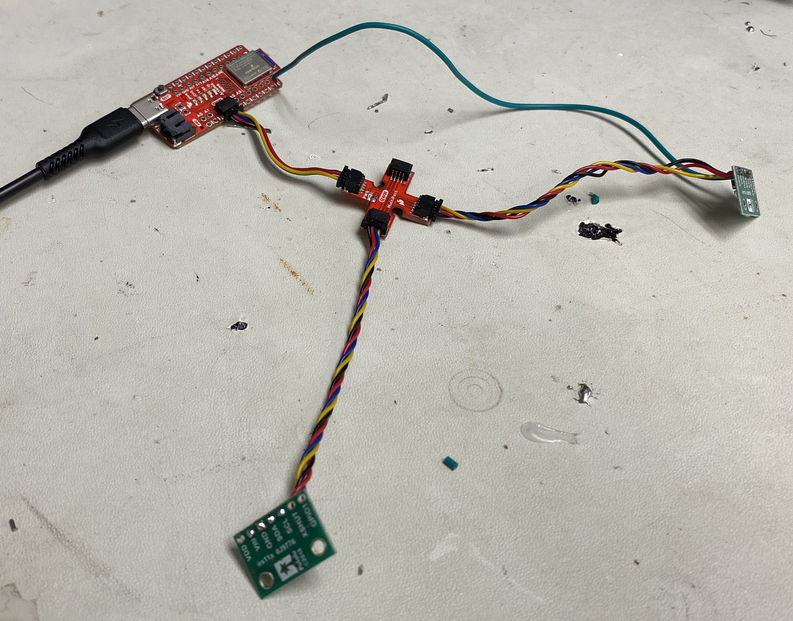

   The testing setup for two Time-of-Flight sensors

We can instantiate the second distance sensor similar to the first, but
giving the ``XSHUT`` pin number as well. This allows us to use the
``sensorOff`` function to turn it off with ``XSHUT``, change the
I\ :sup:`2`\ C address of the other sensor, then use ``sensorOn`` to
turn it back on

.. code-block:: c++
   :caption: Initialization for two ToF sensors

   #define XSHUT 8

   SFEVL53L1X distanceSensor;
   SFEVL53L1X distanceSensor2(Wire, XSHUT);
   
   void setup(void)
   {
     Wire.begin();
   
     // ...
   
     pinMode(XSHUT, OUTPUT);
     distanceSensor2.sensorOff(); // Turn the second sensor off
   
     // Change the I2C address of the first sensor - default is 0x52
     distanceSensor.setI2CAddress(0x54);
   
     while (distanceSensor.begin() != 0) //Begin returns 0 on a good init
     {
       Serial.println("Sensor failed to begin. Please check wiring. Freezing...");
       delay(500);
     }
     Serial.println("Sensor 1 online!");
   
     distanceSensor2.sensorOn(); // Turn the second sensor back on
     while (distanceSensor2.begin() != 0) //Begin returns 0 on a good init
     {
       Serial.println("Sensor failed to begin. Please check wiring. Freezing...");
       delay(500);
     }
     Serial.println("Sensor 2 online!");
     distanceSensor.setDistanceModeShort();
     distanceSensor2.setDistanceModeShort();
   }

.. youtube:: 82lRl_C0YtE
   :align: center
   :width: 70%

To see just how fast we can get this data, we can have the sensors
continuously ranging, and only collect data in the main loop when
it's ready:

.. code-block:: c++
   :caption: Optimized data collection loop

   void loop(void) {
     int start_time = millis();
   
     // Check the first distance sensor
     if (distanceSensor.checkForDataReady()) {
       int distance_1 = distanceSensor.getDistance();
       distanceSensor.clearInterrupt();
       Serial.print(" - Distance 1 (mm): ");
       Serial.println(distance_1);
     }
     
     // Check the second distance sensor
     if (distanceSensor2.checkForDataReady()) {
       int distance_2 = distanceSensor2.getDistance();
       distanceSensor2.clearInterrupt();
       Serial.print(" - Distance 2 (mm): ");
       Serial.println(distance_2);
     }
   
     // Print the time
     int end_time = millis();
     Serial.print("Loop Time (ms): ");
     Serial.println(end_time - start_time);
   }

.. code-block:: text
   :caption: Sample output (50ms timing budget)

   Loop Time (ms): 4
    - Distance 1 (mm): 4
   Loop Time (ms): 7
   Loop Time (ms): 4
   Loop Time (ms): 4
   Loop Time (ms): 4
   Loop Time (ms): 4
   Loop Time (ms): 4
   Loop Time (ms): 3
    - Distance 2 (mm): 553
   Loop Time (ms): 7
   Loop Time (ms): 3
   Loop Time (ms): 3
   Loop Time (ms): 3
   Loop Time (ms): 4
   Loop Time (ms): 4
   Loop Time (ms): 4
   Loop Time (ms): 4
   Loop Time (ms): 4
   Loop Time (ms): 3
   Loop Time (ms): 3
    - Distance 1 (mm): 5
   Loop Time (ms): 7

We can see that we are able to loop much faster than our data
acquisition; our limiting factor is our sensors' ability
to measure data, not our ability to receive it from them.

Time-of-Flight and IMU Data
""""""""""""""""""""""""""""""""""""""""""""""""""""""""""""""""""""""""""

Finally, we can combine all three sensors!

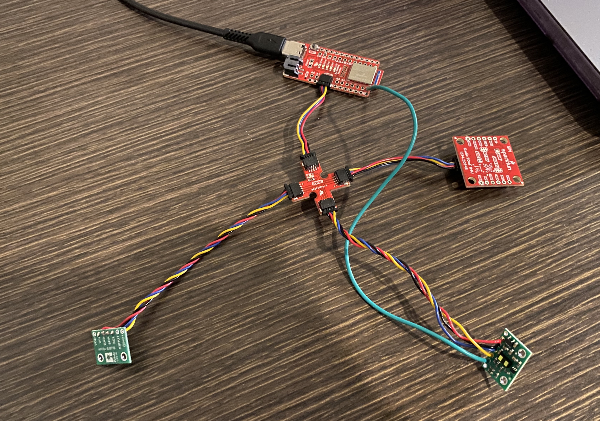

   The testing setup for two Time-of-Flight sensors and the IMU sensor,
   as seen in the wiring diagram

We can then build on our previous code to log and send data in bulk.
Here, I'm using the accelerometer attitude from the IMU, so we can
visually see our perturbations without worrying about drift.

.. code-block:: c++
   :caption: Data logging loop

   float get_pitch() {
     float x, z;
     x = myICM.accX();
     z = myICM.accZ();
   
     return atan2(x, z) * 180 / M_PI;
   }
   
   float get_roll() {
     float y, z;
     y = myICM.accY();
     z = myICM.accZ();
   
     return atan2(y, z) * 180 / M_PI;
   }
   
   void log_data() {
     for (int i = 0; i < ENTRIES_TO_RECORD; i++) {
       data_time[i] = (int)millis();
   
       // -------------------------------------------------------------------
       // Distance Sensor 1
       // -------------------------------------------------------------------
   
       distanceSensor.startRanging();
       while (!distanceSensor.checkForDataReady()) {
         delay(1);
       }
       data_distance[i] =
           distanceSensor.getDistance();  // Get the result of the measurement from
                                          // the sensor
       distanceSensor.clearInterrupt();
       distanceSensor.stopRanging();
   
       // -------------------------------------------------------------------
       // Distance Sensor 2
       // -------------------------------------------------------------------
   
       distanceSensor2.startRanging();
       while (!distanceSensor2.checkForDataReady()) {
         delay(1);
       }
       data_distance_two[i] =
           distanceSensor2.getDistance();  // Get the result of the measurement
                                           // from the sensor
       distanceSensor2.clearInterrupt();
       distanceSensor2.stopRanging();
   
       // -------------------------------------------------------------------
       // IMU- Gyroscope
       // -------------------------------------------------------------------
   
       while (!myICM.dataReady()) {
         delay(1);
       }
       myICM.getAGMT();
       data_pitch[i] = get_pitch();
       data_roll[i] = get_roll();
     }
   }

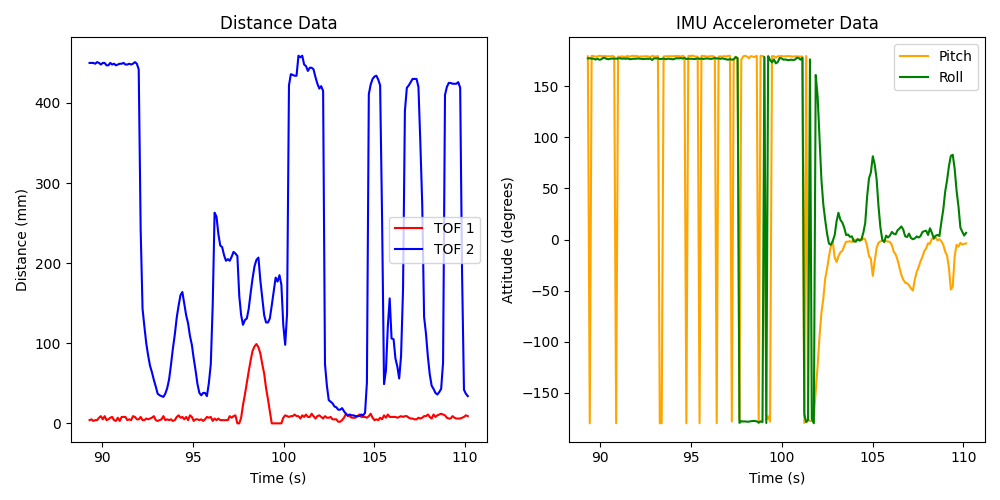

.. youtube:: lO7g9aAD5Ss
   :align: center
   :width: 70%

IR Distance Sensors
--------------------------------------------------------------------------

In this lab, we used an IR Time-of-Flight sensor; however, other IR
distance sensors exist, which we may wish to compare on key metrics.
These include:

Triangulation/Angle-Based IR
""""""""""""""""""""""""""""""""""""""""""""""""""""""""""""""""""""""""""

  * Example: `SHARP GP2Y0A21YK0F <https://www.digikey.com/en/products/detail/olimex-ltd/SNS-GP2Y0A21YK0F/21662340?gclsrc=aw.ds&&utm_adgroup=&utm_source=google&utm_medium=cpc&utm_campaign=PMax%20Shopping_Product_High%20ROAS%20Categories&utm_term=&utm_content=&utm_id=go_cmp-20222717502_adg-_ad-__dev-c_ext-_prd-21662340_sig-CjwKCAiAiOa9BhBqEiwABCdG8-B46BzKLpoKTShh4X85yosEs3B0fFIWbr8zRHtYJZPm3JE2ItlgkRoCKlYQAvD_BwE&gad_source=1&gclid=CjwKCAiAiOa9BhBqEiwABCdG8-B46BzKLpoKTShh4X85yosEs3B0fFIWbr8zRHtYJZPm3JE2ItlgkRoCKlYQAvD_BwE&gclsrc=aw.ds>`_
  * Operation: Measure the angle of reflected IR light to determine position
  * Price: $6.19
  * Range: 10 - 80cm
  * **Pros**:

    * Simple calculations
    * Insensitive to target color/texture
    * Cheap

  * **Cons**:

    * Bulky (large sensor footprint)
    * Variation with ambient light

Amplitude IR
""""""""""""""""""""""""""""""""""""""""""""""""""""""""""""""""""""""""""

  * Example: `VCNL4040 <https://www.digikey.com/en/products/detail/sparkfun-electronics/SEN-15177/9953916?gclsrc=aw.ds&&utm_adgroup=&utm_source=google&utm_medium=cpc&utm_campaign=PMax%20Shopping_Product_Low%20ROAS%20Categories&utm_term=&utm_content=&utm_id=go_cmp-20243063506_adg-_ad-__dev-c_ext-_prd-9953916_sig-CjwKCAiAiOa9BhBqEiwABCdG83NfgHtJgNk55tUvzwuRy_dokOFAHIW8AufFLE8OohT80ByWXuj4ZxoCjWAQAvD_BwE&gad_source=1&gclid=CjwKCAiAiOa9BhBqEiwABCdG83NfgHtJgNk55tUvzwuRy_dokOFAHIW8AufFLE8OohT80ByWXuj4ZxoCjWAQAvD_BwE&gclsrc=aw.ds>`_
  * Operation: Meausure the strength of reflected IR light
  * Price: $7.50
  * Range: 0 - 20cm
  * **Pros**:

    * Simple calculations
    * Cheap

  * **Cons**:

    * Limited range
    * Sensitive to target color/texture and ambient light (may need to change integration time)

Time-of-Flight IR
""""""""""""""""""""""""""""""""""""""""""""""""""""""""""""""""""""""""""

  * Example: `VL53L1X (our sensor!) <https://www.pololu.com/product/3415>`_
  * Operation: Measure the time for IR light to reflect
  * Price: $23.50
  * Range: 4 - 400cm
  * **Pros**:

    * Small sensor
    * Insensitive to target color/texture
    * Range

  * **Cons**:

    * Complex calculations
    * Price

For the steep price of our sensor, we get a lot more range, as well as
a reasonably small profile that can fit on our car.

We also get resilience to the color/texture of what we detect. To
verify this, I swept distance measurements again with
our ToF sensor targeting a variety of household objects (a rough red folder,
a cereal box, and a cutting board). The results below show some variation
as colors become cooler, but not in the range of quality results; overall,
they were similar to each other and previous results.

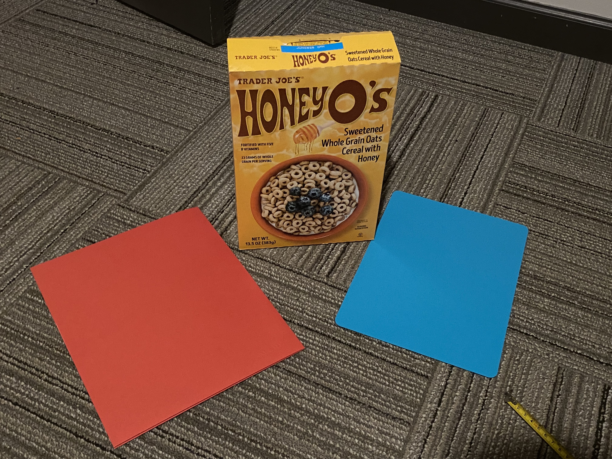

   The objects used for testing

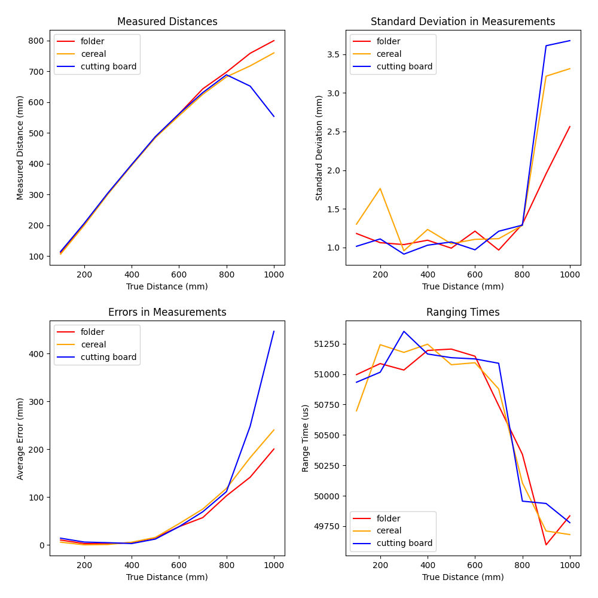