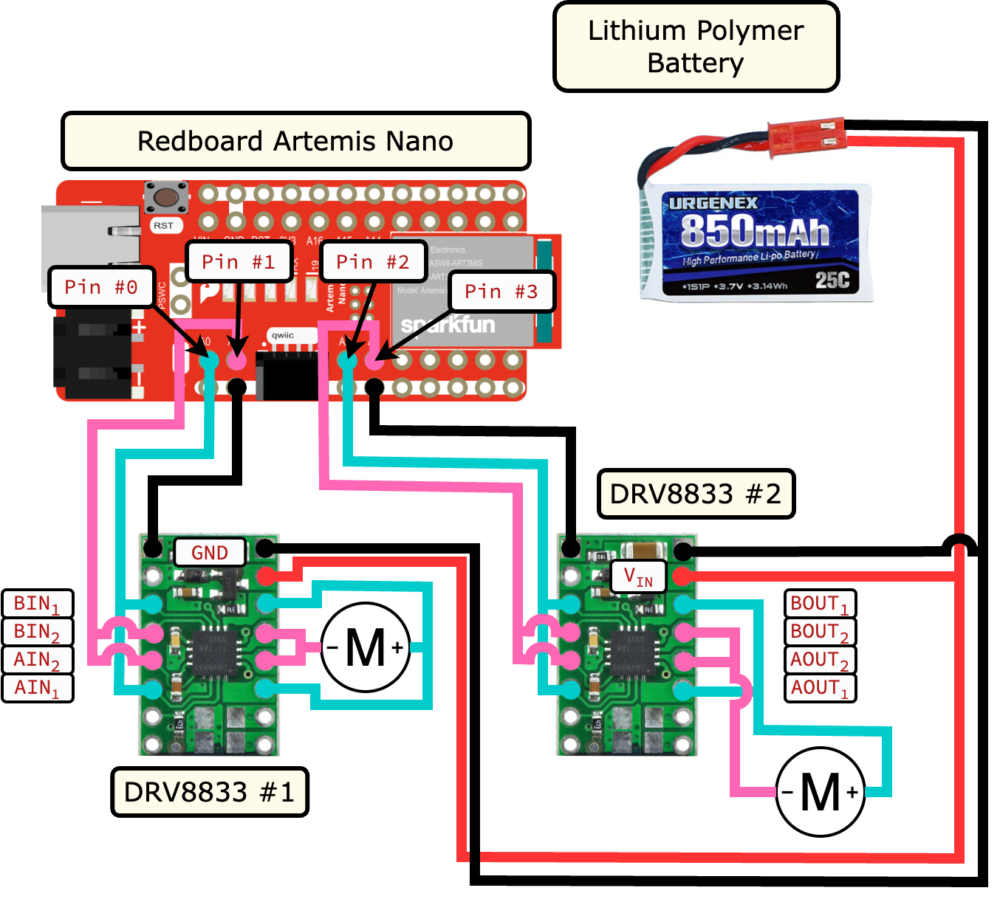

.. ECE 5160 Lab 4 Write-Up: Open-Loop Motor Control

Lab 4: Open-Loop Motor Control
==========================================================================

Now that we can get data around us, we can integrate our electronics into
our robot, including controlling the wheel-driving motors!

Prelab
--------------------------------------------------------------------------

For this lab, we expanded on our hardware setup by introducing two DRV8833
motor drivers to control the motors. These connect to an external battery
to drive the motors, as well as with PWM inputs (and ground) from the
Artemis. Accordingly, I chose analog pins to be able to provide the PWM
output (A0 - A3)

.. admonition:: External Battery
   :class: info

   Note that the motor drivers/motors are connected to a separate power
   supply than the other electronics. The relatively high power,
   fast-switching motor supply will cause EMI ripples in the power supply.
   To avoid this interfering with our other sensitive electronics (such as
   out sensors and microcontroller), the power supplies are decoupled.

Motor Drivers - Oscilloscope
--------------------------------------------------------------------------

To incrementally verify our motor driving capability, I first connected
one motor driver to the Artemis. The PWM signals were generated on the
motor driver inputs, and the outputs were connected to the oscilloscope
probes for measuring, with the motor voltage driven by a voltage supply.

.. admonition:: Power Supply
   :class: info

   The `DRV8833 datasheet <https://www.ti.com/lit/ds/symlink/drv8833.pdf?HQS=dis-dk-null-digikeymode-dsf-pf-null-wwe&ts=1740659196269>`_
   notes that the motor voltage can range from 2.7V to 10.8V. However,
   we will be driving our motors with a `3.7V battery <https://www.amazon.com/URGENEX-Battery-Rechargeable-Quadcopter-Charger/dp/B08T9FB56F/ref=sr_1_3?keywords=lipo+battery+3.7V+850mah&qid=1639066404&sr=8-3>`_,
   so I chose to set the voltage supply to 3.7V to be more realistic.

<include setup picture>

The code snippet below demonstrates the PWM functionality by sweeping
the duty cycle of a forward-driving motor, where the ``IN1`` pin is kept
high, and ``IN2`` switches rapidly (inspired by Nila Narayan's example
from 2024):

.. code-block:: c++
   :caption: PWM test code for a forward-driving motor

   #define HIGH_PIN 0 // AIN1 / BIN1
   #define PWM_PIN 1  // AIN2 / BIN2
   
   void setup(){
     pinMode( HIGH_PIN, OUTPUT );
     pinMode(  PWM_PIN, OUTPUT );
   }
   
   void loop(){
     analogWrite( HIGH_PIN, HIGH );
     for( int i = 0; i < 255; i = i + 1 ){
       analogWrite( PWM_PIN, i );
     }
   }

.. youtube:: TRONEOA6_nA
   :align: center
   :width: 70%

Once we verified one motor driver, I soldered the second one to
verify it as well; the snippet below similarly sweeps the duty
cycle, but increases the duty cycle of the first forward-driving
motor while decreasing that of the second reverse motor.

.. code-block:: c++
   :caption: PWM test code for complementary motors

   #define MOTOR1_IN1 0
   #define MOTOR1_IN2 1
   #define MOTOR2_IN1 2
   #define MOTOR2_IN2 3
   
   void motor1_forward(uint8_t i) {
     analogWrite(MOTOR1_IN1, HIGH);
     analogWrite(MOTOR1_IN2, i   );
   }
   
   void motor2_reverse(uint8_t i) {
     analogWrite(MOTOR2_IN1, 255 - i );
     analogWrite(MOTOR2_IN2, HIGH);
   }
   
   void setup() {
     pinMode(MOTOR1_IN1, OUTPUT);
     pinMode(MOTOR1_IN2, OUTPUT);
     pinMode(MOTOR2_IN1, OUTPUT);
     pinMode(MOTOR2_IN2, OUTPUT);
   }
   
   void loop() {
     for (int i = 0; i < 255; i = i + 1) {
       motor1_forward( i );
       motor2_reverse( i );
     }
   }

<include setup picture>

.. youtube:: GNM55a-WYec
   :align: center
   :width: 70%