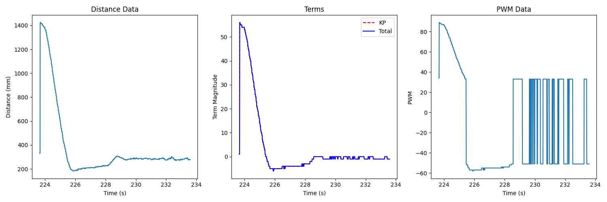
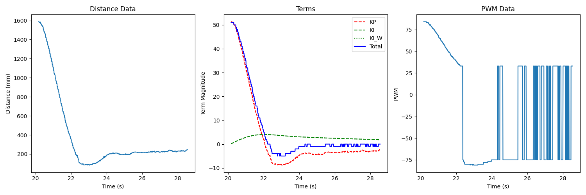
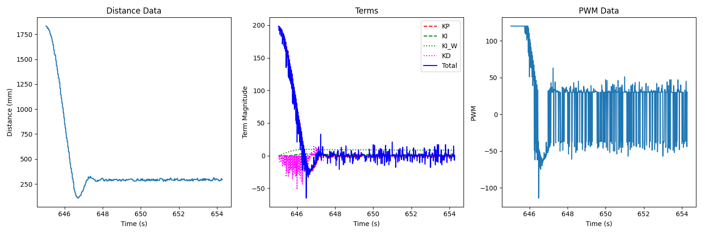
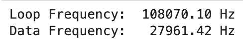
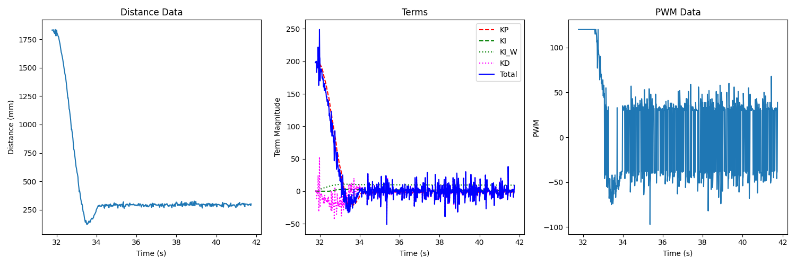
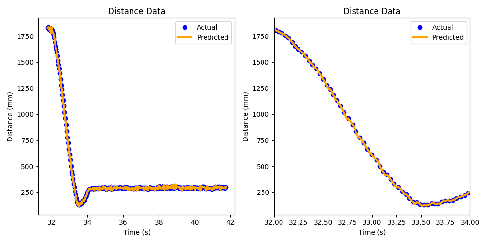
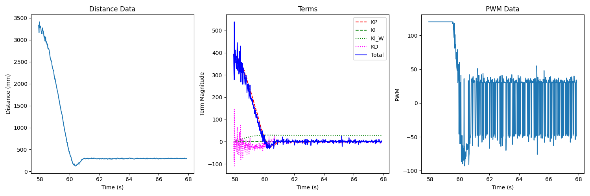
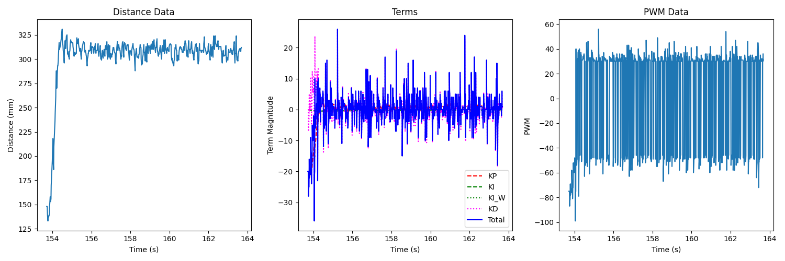
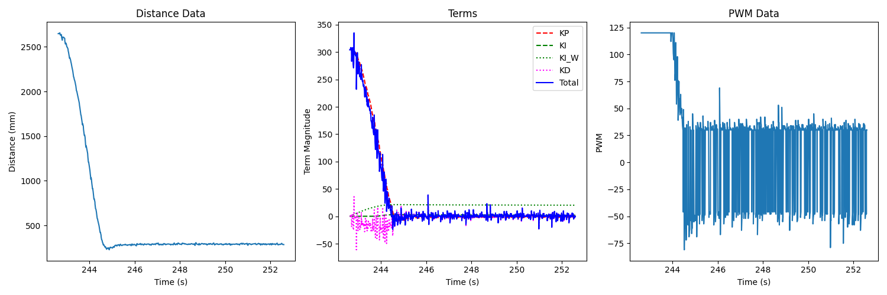
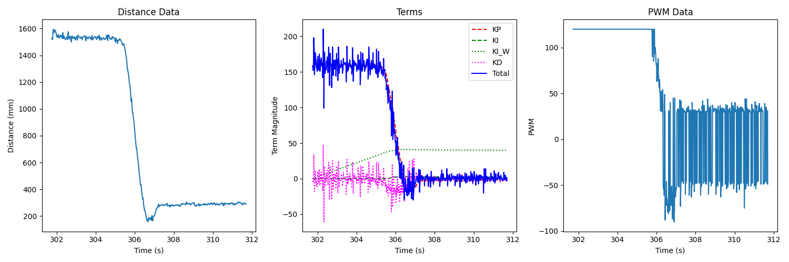

.. ECE 5160 Lab 5 Write-Up: PID Control

Lab 5: PID Control
==========================================================================

Now that we've assembled our robot, we can introduce a PID control
system to help it navigate. In this lab, we use PID control to navigate
the robot 1 foot away from a wall.

Prelab
--------------------------------------------------------------------------

In this lab, it was especially important to communicate data over
Bluetooth, as it was the only way to gain visibility into the values
used in the algorithm, and adjust PID gains appropriately. To do this,
I defined a function ``log_pid_data`` on the Arduino, which our PID
loop could call; it would log various pieces of data, including:

* The current time
* Whether ToF data was ready
* The measured distance
* The terms generated from PID control (including the integrator terms
  with and without windup protection - useful for the M.Eng. portion)
* The total PID control output
* The PWM sent to the motors

.. code-block:: c++

   void log_pid_data( int time, bool data_ready, int distance, int kp_term,
                      int ki_term, int windup_term, int kd_term, int total_term, int motor_pwm )
   {
     if ( entry_idx < MAX_NUM_ENTRIES ) {
       time_entries[entry_idx]       = time;
       data_ready_entries[entry_idx] = data_ready;
       distance_entries[entry_idx]   = distance;
       kp_term_entries[entry_idx]    = kp_term;
       ki_term_entries[entry_idx]    = ki_term;
       windup_term_entries[entry_idx] = windup_term;
       kd_term_entries[entry_idx]    = kd_term;
       total_term_entries[entry_idx] = total_term;
       motor_pwm_entries[entry_idx]  = motor_pwm;
       entry_idx += 1;
     }
   }

From here, I defined a BLE command ``GET_PID_DATA`` to retrieve all of
the recorded data

.. code-block:: c++
   :class: toggle

   // Case statement from within handle_command()

   case GET_PID_DATA:
      Serial.printf("Getting data...\n");
      for ( int i = 0; i < entry_idx; i++ ) {
        tx_estring_value.clear();
        tx_estring_value.append( time_entries[i] );
        tx_estring_value.append( "|" );
        tx_estring_value.append( (int) data_ready_entries[i] );
        tx_estring_value.append( "|" );
        tx_estring_value.append( distance_entries[i] );
        tx_estring_value.append( "|" );
        tx_estring_value.append( kp_term_entries[i] );
        tx_estring_value.append( "|" );
        tx_estring_value.append( ki_term_entries[i] );
        tx_estring_value.append( "|" );
        tx_estring_value.append( windup_term_entries[i] );
        tx_estring_value.append( "|" );
        tx_estring_value.append( kd_term_entries[i] );
        tx_estring_value.append( "|" );
        tx_estring_value.append( total_term_entries[i] );
        tx_estring_value.append( "|" );
        tx_estring_value.append( motor_pwm_entries[i] );
        tx_characteristic_string.writeValue( tx_estring_value.c_str() );
      }
      break;

All that was needed to receive the data was a custom handler to
receive BLE notifications in Python:

.. code-block:: python
   :class: toggle

   def parse_data( data: str ):
     data_components = data.split("|")
     time       = (float(data_components[0]) / 1000)
     ready = bool(int(data_components[1]))
     distance   = int(data_components[2])
     kp_term    = int(data_components[3])
     ki_term    = int(data_components[4])
     windup_term = int(data_components[5])
     kd_term    = int(data_components[6])
     total_term = int(data_components[7])
     motor_pwm  = int(data_components[8])
     return time, ready, distance, kp_term, ki_term, windup_term, kd_term, total_term, motor_pwm
   
   def data_handler(_uid, response):
     global i
     time, ready, distance, kp_term, ki_term, windup_term, kd_term, total_term, motor_pwm = parse_data(response.decode())
     data_time.append(time)
     data_ready.append(ready)
     data_distance.append(distance)
     data_kp_term.append(kp_term)
     data_ki_term.append(ki_term)
     data_windup_term.append(windup_term)
     data_kd_term.append(kd_term)
     data_total_term.append(total_term)
     data_motor_pwm.append(motor_pwm)
     i = i + 1
     print(f"{i * 100 / NUM_SAMPLES:.2f}% done", end = '\r')
   
   ble.start_notify(ble.uuid['RX_STRING'], data_handler)
   ble.send_command(CMD.GET_PID_DATA, "")

After testing with some dummy data, I was successfully able to communicate
data and parse it, providing an invaluable tool for later debugging.

The other thing I did before beginning the lab was to revisit code from
past labs, and package them into object-oriented classes for easier
handling and re-use. As an example, here is the header file for my
``Car`` implementation (which utilizes the ``Wheel`` class to drive
motors):

.. code-block:: c++

   class Car {
    public:
     Car( int MOTOR1_IN1_PIN, int MOTOR1_IN2_PIN, int MOTOR2_IN1_PIN,
          int MOTOR2_IN2_PIN )
         : motor1( MOTOR1_IN1_PIN, MOTOR1_IN2_PIN ),
           motor2( MOTOR2_IN1_PIN, MOTOR2_IN2_PIN ) {};
   
     // Calibration from Lab 4
     void set_motor2_calibration( float factor )
     {
       motor2.set_calibration_factor( factor );
     }
   
     // Motor functions from Lab 4
     void forward( uint8_t pwm );
     void backward( uint8_t pwm );
     void left( uint8_t pwm );
     void right( uint8_t pwm );
     void stop();
     void coast();
   
    private:
     Wheel motor1, motor2;
   };

This makes our code more portable and abstracts the details from
the PID interface.

Designing the PID Controller
--------------------------------------------------------------------------

In this lab, we built up to a PID control system, which uses proportional,
integral, and derivative error terms to determine how much to drive the
motors to get 1 foot from a wall, determining motor PWM from error terms:

.. math::

   u(t) = K_Pe(t) + K_I \int_0^te(t)\delta t + K_D \frac{\delta e(t)}{\delta t}

I began with only using a proportional term:

.. code-block:: c++

   void PID::update( int u )
   {
      int error = u - set_point;
      terms.kp_term = error * params.kp;
   }

   int PID::get_control()
   {
     return terms.kp_term;
   }

A ``PID`` object was updated in the main loop with new ToF values
when available (using the previous if not):

.. code-block:: c++
   :class: toggle

   void run_pid_step()
   {
     curr_time = millis();
     int curr_distance, curr_kp_term, curr_ki_term, curr_ki_windup,
         curr_kd_term, curr_total_term, curr_motor_pwm;
     
     bool data_ready;
     if( tofs.sensor1.checkForDataReady() ){
       curr_distance = tofs.sensor1.getDistance();
       last_distance = curr_distance;
       tofs.sensor1.clearInterrupt();
       tofs.sensor1.stopRanging();
       tofs.sensor1.startRanging();
       data_ready = true;
     } else {
       curr_distance = last_distance;
       data_ready = false;
     }
   
     pid.update( curr_distance );
     curr_total_term   = pid.get_control();
     curr_kp_term      = pid.terms.kp_term;
     curr_ki_term      = pid.terms.ki_term;
     curr_ki_windup    = pid.terms.ki_windup_term;
     curr_kd_term      = pid.terms.kd_term;
     curr_motor_pwm = pid.scale( curr_total_term );
     if ( curr_motor_pwm > 0 ) {
       car.forward( curr_motor_pwm );
     }
     else {
       car.backward( -1 * curr_motor_pwm );
     }
   
     log_pid_data( curr_time, data_ready, curr_distance, curr_kp_term,
                   curr_ki_term, curr_ki_windup, curr_kd_term, curr_total_term, curr_motor_pwm );
   }

   void loop()
   {
     // Main loop code...
     while ( central.connected() ) {
       if ( run_pid ) { // Set by RUN_PID BLE Command
         run_pid_step();
         if ( curr_time - pid_start_time > 10000 ) {
           stop_pid(); // run_pid = false
         }
       }
     }
   }

Note that after 10 seconds, or if Bluetooth disconnects, PID control
stops (as a failsafe).

Also note that I included a ``pid.scale()`` function; this imposed an upper
limit on the PWM value, moved it outside of the deadband, and also
helped account for the lesser drive strength I observed when reversing:

.. code-block:: c++

   int PID::scale( int pid_output )
   {
     float intermediate_term = pid_output;
   
     // Scale outside deadband
     if ( intermediate_term >= 0 ) {
       intermediate_term += deadband;
     }
     else {
       intermediate_term -= deadband * 1.5;
     }
   
     // Reverse having issues, so scale
     if( intermediate_term < 0 ){
       intermediate_term *= 1.5;
     }
   
     // Max PWM of 120
     if ( intermediate_term > 120 ) {
       intermediate_term = 120;
     } else if ( intermediate_term < -120 ) {
       intermediate_term = -120;
     }
   
     return intermediate_term;
   }

From here, I was able to get a successful result using
:math:`K_p = 0.05`, albeit with some overshooting.

(The robot initially turns from some slipping, not lack of calibration).

.. youtube:: HmI5krO30OU
   :align: center
   :width: 70%

From here, I added an integral term:

.. code-block:: c++

   void PID::update( int u )
   {
      int error = u - set_point;
      if ( first_time ) { // Only run the first time, to set last_time
        last_time = micros();
      }
    
      // ---------------------------------------------------------------------
      // Proportional
      // ---------------------------------------------------------------------
    
      terms.kp_term = error * params.kp;
    
      // ---------------------------------------------------------------------
      // Integral
      // ---------------------------------------------------------------------
    
      int curr_time = micros();
      float dt = (float)(curr_time - last_time);
      last_time = curr_time;
    
      // Perform in terms of seconds, like model
      if( !this->clamp(error) ){
        terms.ki_term += params.ki * ((float) error) * dt / 1000000.0;
      }
    
      terms.ki_windup_term += params.ki * ((float) error) * dt / 1000000.0;
   }

   int PID::get_control()
   {
     // PI Controller
     curr_control = terms.kp_term + terms.ki_term;
     return curr_control;
   }

Note the only integrate when ``clamp()`` is false; this is discussed more
in the M.Eng. section.

I found initial success with
:math:`K_p = 0.04, K_I = 0.003`:

<insert video>

This resulted in a constant offset from the integrator; however, this was
resolved later by moving faster, clamping the integrator on the approach.

Finally, I introduced a derivative term to slow the approach.
To avoid derivative kick, I low-passed it by factoring in the previous
value (finding experimentally that :math:`\alpha = 0.25` works well),
and didn't update the first time (when :math:`\delta t` was near-zero):

.. code-block:: c++

   void PID::update( int u )
   {
      int error = u - set_point;
      if ( first_time ) {
        last_time = micros();
        error_hist = error;
      }
    
      // ---------------------------------------------------------------------
      // Proportional
      // ---------------------------------------------------------------------
    
      terms.kp_term = error * params.kp;
    
      // ---------------------------------------------------------------------
      // Integral
      // ---------------------------------------------------------------------
    
      int curr_time = micros();
      float dt = (float)(curr_time - last_time);
      last_time = curr_time;
    
      // Perform in terms of seconds, like model
      if( !this->clamp(error) ){
        terms.ki_term += params.ki * ((float) error) * dt / 1000000.0;
      }
    
      terms.ki_windup_term += params.ki * ((float) error) * dt / 1000000.0;
    
      // ---------------------------------------------------------------------
      // Derivative
      // ---------------------------------------------------------------------
    
      if( !first_time ){
        float derivative = (float)(error - error_hist) * 1000000.0 / dt;
        terms.kd_term = params.kd * (float)((float)(alpha * derivative) + ((float)(1 - alpha) * terms.kd_term));
      }
   }

   int PID::get_control()
   {
     // PID Controller
     curr_control = terms.kp_term + terms.ki_term + terms.kd_term;
     return curr_control;
   }

This final PID controller worked well with :math:`K_P = 0.13, K_I = 0.008, K_D = 0.05`

<insert video>

Range/Sampling Time
--------------------------------------------------------------------------

The PID controller is limited by how often we can get new data; to help, I
increased our data rate by changing the ranging time, sacrificing
speed for accuracy:

.. code-block:: c++

   #include "SparkFun_VL53L1X.h"

   // In ToF sensor initialization

   sensor.setTimingBudgetInMs( 33 );
   sensor.setIntermeasurementPeriod( 40 );

We can use the logger data in Python to determine loop and data rates:

.. code-block:: python
   
   loop_frequency = (len(data_time) - 1) / (data_time[-1] - data_time[0])
   print(f"Loop Frequency: {loop_frequency:>7.2f} Hz")
   
   ready_data_times = []
   for i in range(len(data_time)):
     if( data_ready[i] ):
       ready_data_times.append(data_time[i])
   
   data_frequency = (len(ready_data_times) - 1) / (ready_data_times[-1] - ready_data_times[0])
   print(f"Data Frequency: {data_frequency:>7.2f} Hz")

I was getting a new value every ~4 iterations. To
improve upon this, I kept track of past distances to linearly extrapolate new
data points when distance isn't available:

.. code-block:: c++
   :caption: Revised PID step

   int interp_distance(){
     // Interpolate distance when none available
     if( last_last_distance_valid ){
       float slope = ((float)(last_distance      - last_last_distance)) / 
                     ((float)(last_distance_time - last_last_distance_time));
   
       return last_distance + (slope * ((float)millis() - last_distance_time));
     }
   
     // Otherwise, return last data point
     return last_distance;
   }
   
   void run_pid_step()
   {
     curr_time = millis();
     int curr_distance;
     
     bool data_ready; // Use to log if data was ready
     if( tofs.sensor1.checkForDataReady() ) {
       // Shift values
       last_last_distance       = last_distance;
       last_last_distance_valid = last_distance_valid;
       last_last_distance_time  = last_distance_time;
   
       curr_distance       = tofs.sensor1.getDistance();
       last_distance       = curr_distance;
       last_distance_time  = curr_time;
       last_distance_valid = true;
       data_ready          = true;

       // Start ranging again
       tofs.sensor1.clearInterrupt();
       tofs.sensor1.stopRanging();
       tofs.sensor1.startRanging();
     } else {
       curr_distance = interp_distance();
       data_ready = false;
     }
     // Execute PID control like before...
   }

Comparing to before, our better data helped to avoid oscillations:

<insert video>

Final System
--------------------------------------------------------------------------

We can demonstrate the system's capabilities to settle quickly by running
from a long distance (around 3 meters).

<insert video>

It also showed success when starting closer than the set point, around
half a foot:

<insert video>

Finally, the closed-loop control allows it to run successfully on
multiple surfaces, including the carpet in my apartment (having
less oscillation from more traction), about 3.5 meters:

<insert video>

[ECE 5160] Integrator Windup
--------------------------------------------------------------------------

An important factor in our controller is protection against *windup*,
where the integrator excessively accumulates when not moving, such that
the overshoot caused by buildup is large. We protect against this by
only accumulating when we're not "clamping",:

.. code-block:: c++

   bool PID::clamp(int error) {
     // Clamp if we're at the maximum control and our error sign matches
     return (( curr_control > 180 ) || ( curr_control < -180 )) & 
            (error * curr_control > 0);
   }

To show this effect, I ran the same control loop while accumulating a
non-clamped term, and initially held the car in-place to accumulate error:

<insert video>

We can see that the non-clamped term builds up ("winds up"), which
may lead to overshoot. However, since our actual term is clamped,
no such buildup occurs when at max control, and we don't encounter
a large overshoot.

Acknowledgements
--------------------------------------------------------------------------

This lab was one of the hardest so far for me, but also one of the most
educational. I hadn't encountered PID controllers before, and struggled
learning how best to tune them and what different behaviours meant.
After going through the lab, I feel much more confident in PID controllers,
and appreciate how relatively few lines of code can capture complex
behaviours. I'd like to credit the TAs a lot to my success, for staring
at my plots with me and figuring out the best next steps.