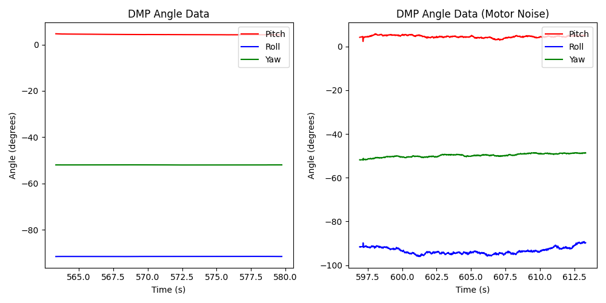
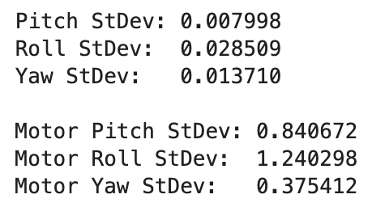
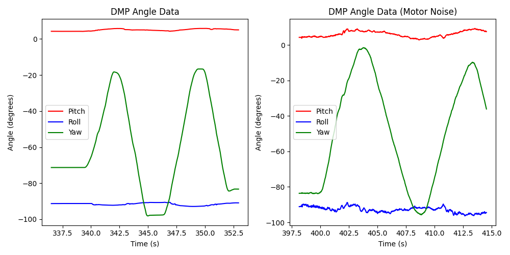
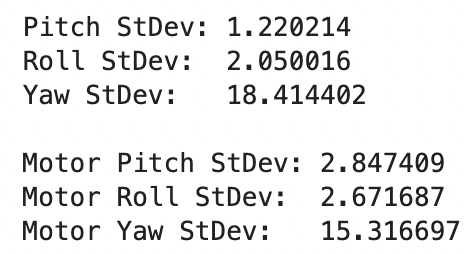
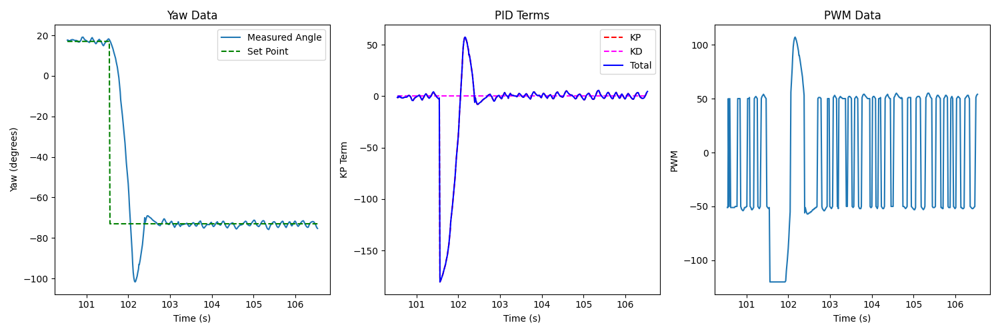
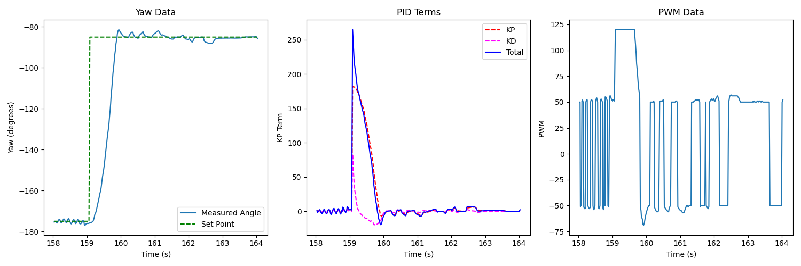
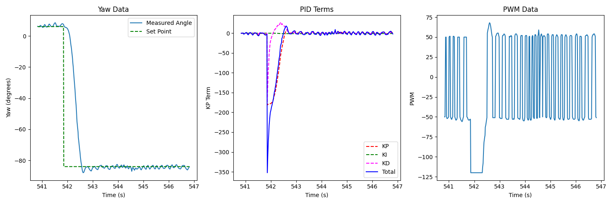
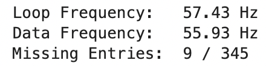
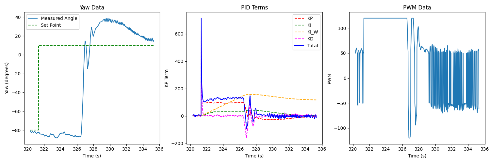

.. ECE 5160 Lab 6 Write-Up: PID Control

Lab 6: Orientation Control
==========================================================================

After demonstrating success with PID control with lateral movement,
we can also use it to control our orientation angle.

Prelab
--------------------------------------------------------------------------

Last lab proved how invaluable having data logging and transmission was
in debugging, so I set up a similar system for this lab (recording
angles instead of distance). Much of the code is the same from
:doc:`lab5`; I defined a function ``log_pid_data`` to log various
pieces of data for debugging (noting that we'd be recording yaw):

.. code-block:: c++

   void log_pid_data( int time, bool data_ready, double angle, float kp_term,
                      float ki_term, float windup_term, float kd_term,
                      int total_term, int motor_pwm )
   {
     if ( entry_idx < NUM_ENTRIES ) {
       time_entries[entry_idx]        = time;
       data_ready_entries[entry_idx]  = data_ready;
       yaw_entries[entry_idx]         = angle;
       kp_term_entries[entry_idx]     = kp_term;
       ki_term_entries[entry_idx]     = ki_term;
       windup_term_entries[entry_idx] = windup_term;
       kd_term_entries[entry_idx]     = kd_term;
       total_term_entries[entry_idx]  = total_term;
       motor_pwm_entries[entry_idx]   = motor_pwm;
       entry_idx += 1;
     }
   }

The ``GET_PID_DATA`` BLE command would transmit this data:

.. code-block:: c++
   :class: toggle

   // Case statement from within handle_command()

   case GET_PID_DATA:
      Serial.printf("Getting data...\n");
      for ( int i = 0; i < entry_idx; i++ ) {
        tx_estring_value.clear();
        tx_estring_value.append( time_entries[i] );
        tx_estring_value.append( "|" );
        tx_estring_value.append( (int) data_ready_entries[i] );
        tx_estring_value.append( "|" );
        tx_estring_value.append( yaw_entries[i] );
        tx_estring_value.append( "|" );
        tx_estring_value.append( kp_term_entries[i] );
        tx_estring_value.append( "|" );
        tx_estring_value.append( ki_term_entries[i] );
        tx_estring_value.append( "|" );
        tx_estring_value.append( windup_term_entries[i] );
        tx_estring_value.append( "|" );
        tx_estring_value.append( kd_term_entries[i] );
        tx_estring_value.append( "|" );
        tx_estring_value.append( total_term_entries[i] );
        tx_estring_value.append( "|" );
        tx_estring_value.append( motor_pwm_entries[i] );
        tx_characteristic_string.writeValue( tx_estring_value.c_str() );
      }
      break;

This would finally be parsed by our Python notification handler; below
is an example of using the ``GET_PID_DATA`` command from Python, using
the notification handler to parse and record data:

.. code-block:: python
   :class: toggle

   data_time = []
   data_ready = []
   data_yaw = []
   data_kp_term = []
   data_ki_term = []
   data_windup_term = []
   data_kd_term = []
   data_total_term = []
   data_motor_pwm = []

   def parse_data( data: str ):
     data_components = data.split("|")
     time       = (float(data_components[0]) / 1000)
     ready = bool(int(data_components[1]))
     angle      = int(data_components[2])
     kp_term    = int(data_components[3])
     ki_term    = int(data_components[4])
     windup_term = int(data_components[5])
     kd_term    = int(data_components[6])
     total_term = int(data_components[7])
     motor_pwm  = int(data_components[8])
     return time, ready, angle, kp_term, ki_term, windup_term, kd_term, total_term, motor_pwm
   
   def data_handler(_uid, response):
     global i
     time, ready, angle, kp_term, ki_term, windup_term, kd_term, total_term, motor_pwm = parse_data(response.decode())
     data_time.append(time)
     data_ready.append(ready)
     data_yaw.append(angle)
     data_kp_term.append(kp_term)
     data_ki_term.append(ki_term)
     data_windup_term.append(windup_term)
     data_kd_term.append(kd_term)
     data_total_term.append(total_term)
     data_motor_pwm.append(motor_pwm)
     i = i + 1
     print(f"{i * 100 / NUM_SAMPLES:.2f}% done", end = '\r')
   
   ble.start_notify(ble.uuid['RX_STRING'], data_handler)
   ble.send_command(CMD.GET_PID_DATA, "")

This allowed us to have high visibility into the system and investigate
particular terms to debug along the PID control process.

Digital Motion Processing (DMP)
--------------------------------------------------------------------------

Part of the challenge of using IMU data is combining the various sensor
readings into a single one, which ideally reduces the noise from the
accelerometer and the drift from the gyroscope. To aid in this, I
used the Artemis' built-in Digital Motion Processing (DMP) system, which
combined the measurements for us. Following the provided tutorial, I
abstracted the interface to simple functions, seen in the ``dmp.h``
header file:

.. code-block:: c++
   :class: toggle
   
   // =======================================================================
   // dmp.h
   // =======================================================================
   // Declarations for the car functions
   
   #ifndef DMP_H
   #define DMP_H
   
   #include "ICM_20948.h"
   
   typedef struct {
     double angle;
     bool   new_data;
   } dmp_msg_t;
   
   class DMP {
    public:
     DMP( ICM_20948_I2C* ICM ) : icm( ICM ), new_data( false ) {};
     void begin();  // Call after initializing IMU
   
     void update();  // Update from the FIFO - call continuously
   
     // Compute values when needed
     dmp_msg_t roll();
     dmp_msg_t pitch();
     dmp_msg_t yaw();
   
    private:
     ICM_20948_I2C* icm;
     double         qw, qx, qy, qz;
     bool           new_data;
   };

   #endif  // DMP_H

One implementation detail is that the DMP buffer can fill up; to address
this, the ``update()`` function is always called in the main loop, which
updates the internal quaternions with the latest data:

.. code-block:: c++

   void loop()
   {
     // Listen for connections
     BLEDevice central = BLE.central();

     // Always update dmp
     dmp.update();
   
     // If a central is connected to the peripheral
     if ( central ) {
       Serial.print( "Connected to: " );
       Serial.println( central.address() );
   
       // While central is connected
       while ( central.connected() ) {
         // Always update dmp
         dmp.update();

         // Bluetooth read/write
       }
   
       Serial.println( "Disconnected" );
     }
   }

This ensures that the data FIFO buffer wouldn't fill up. To avoid
unnecessary latency, angles are only calculated from quaternions when
needed with the ``pitch()``, ``roll()``, and ``yaw()`` functions
(following the example code), having the added benefit that they
are oriented correctly for our robot using the magnetometer.

Plotting this data over time while turning the robot (both changing yaw
by turning the car, as well as keeping it stationary, with yaw movements
introducing noise from me), and comparing to :doc:`lab2`, we can see a
drastic reduction in noise with minimal drift, indicating a successful
fusion of sensor readings (using Python to calculate standard deviations)

**Stationary:**

**Rotating the Car:**

.. youtube:: UB2pHHn3ULQ
   :align: center
   :width: 70%

Designing the PID Controller
--------------------------------------------------------------------------

Similar to Lab 5, I integrated the main ``run_pid_step`` function (to
update the PID control once) into the main loop, and used the previous
interpolation to linearly extrapolate the angle if new data wasn't
ready:

.. code-block:: c++
   :class: toggle

   void run_pid_step()
   {
     curr_time = millis();
     int   curr_angle, curr_total_term, curr_motor_pwm;
     float curr_kp_term, curr_ki_term, curr_ki_windup, curr_kd_term;
   
     bool      data_ready;
     dmp_msg_t dmp_msg = dmp.yaw();
     if ( dmp_msg.new_data ) {
       // Shift values
       last_last_angle       = last_angle;
       last_last_angle_valid = last_angle_valid;
       last_last_angle_time  = last_angle_time;
   
       curr_angle       = dmp_msg.angle;
       last_angle       = curr_angle;
       last_angle_time  = curr_time;
       last_angle_valid = true;
       data_ready       = true;
       last_angle_valid = true;
     }
     else {
       // No new data - interpolate
       curr_angle = interp_angle();
       data_ready = false;
     }
   
     if ( last_angle_valid ) {
       pid.update( curr_angle );
       curr_total_term = pid.get_control();
       curr_kp_term    = pid.terms.kp_term;
       curr_ki_term    = pid.terms.ki_term;
       curr_ki_windup  = pid.terms.ki_windup_term;
       curr_kd_term    = pid.terms.kd_term;
       curr_motor_pwm  = pid.scale( curr_total_term );
     }
   
     if ( curr_motor_pwm > 30 ) {
       car.right( curr_motor_pwm );
     }
     else if ( curr_motor_pwm < -30 ) {
       car.left( -1 * curr_motor_pwm );
     }
     else {
       car.stop();
     }
   
     if ( last_angle_valid ) {
       log_pid_data( curr_time, data_ready, curr_angle, curr_kp_term,
                     curr_ki_term, curr_ki_windup, curr_kd_term,
                     curr_total_term, curr_motor_pwm );
     }
   }

   // in loop...

   while ( central.connected() ) {
     // Send data over BLE
     write_data();

     // Read data over BLE
     read_data();

     if ( run_pid ) { // Set by RUN_PID BLE command
       run_pid_step();
       if ( curr_time - pid_start_time > 10000 ) {
         // Stop for safety
         stop_pid();
       }
     }
   }

I had the PID's setpoint start as the current angle, and used a
BLE command to change the setpoint (always opposite the current
setpoint sign, to avoid angle overflow):

.. code-block:: c++

   case SET_SETPOINT:
     int new_setpoint;
     success = robot_cmd.get_next_value( new_setpoint );
     if ( !success ) {
       return;
     }
     if( pid.get_setpoint() > 0 ){
       new_setpoint = pid.get_setpoint() - new_setpoint;
     } else {
       new_setpoint = pid.get_setpoint() + new_setpoint;
     }
     pid.set_setpoint( new_setpoint );
     break;

Similar to Lab 5, I started with only a proportional term; I reused my
PID code, and simply set the gains of the others to 0. This resulted
in a moderate control system with some overshoot (using :math:`K_P = 2`\ )

.. youtube:: tNQsmQj0_vM
   :align: center
   :width: 70%

Noting the overshoot, I added a derivative term. In an ideal world, I
would use the gyroscope output, as this already gives the angular
derivative (without giving extra noise from the accelerometer and
taking the integral of a derivative measurement). However, doing so
with the DMP reduced the sampling rate from the previous maximum from
the overall Game Rotation Vector (225KHz) to
the maximum of the gyroscope (1125Hz), resulting in a slow system with
poor performance. Instead, I integrated the DMP on its own (which was
still not too noisy, shown above). This helped reduce the overshoot; I
found success with :math:`K_P = 2, K_D = 0.1`\ :

.. youtube:: frHOYDSOfOc
   :align: center
   :width: 70%

Finally, I incorporated the integral term, although not much was needed,
as there wasn't much constant offset; I ended up using
:math:`K_P = 2, K_I = 0.1, K_D = 0.1` for my final system, which helped
the final value settle close to the set point with minimal oscillations:

.. youtube:: Xk0Iwh1s_Lc
   :align: center
   :width: 70%

Range/Sampling Time
--------------------------------------------------------------------------

We can use the same approach as Lab 5 to use whether the data was ready
for each update to compute the update frequency (filtering out timestamps
when data wasn't ready):

.. code-block:: python

   loop_frequency = (len(data_time) - 1) / (data_time[-1] - data_time[0])
   print(f"Loop Frequency: {loop_frequency:>7.2f} Hz")
   
   ready_data_times = []
   for i in range(len(data_time)):
     if( data_ready[i] ):
       ready_data_times.append(data_time[i])
   
   data_frequency = (len(ready_data_times) - 1) / (ready_data_times[-1] - ready_data_times[0])
   print(f"Data Frequency: {data_frequency:>7.2f} Hz")
   print(f"Missing Entries:  {len(data_time) - len(ready_data_times)} / {len(data_time)}")

Here, we can see that the full-speed DMP is able to keep up with
our loop, (much more than the Lab 5 ToF sensors), only missing a few
entries.

[ECE 5160] Integrator Windup
--------------------------------------------------------------------------

Finally, we want to make sure that our integrator
doesn't "wind up" and accumulate when it doesn't affect the output. This
is done similarly to Lab 5, where we clamp the integrator when the output
is maximal and integrating would unnecessarily accumulate values:

.. code-block:: c++

   // In the PID update

   int   curr_time = micros();
   float dt        = (float) ( curr_time - last_time );
   last_time       = curr_time;

   // Perform in terms of seconds, like model
   if ( !this->clamp( error ) ) {
     terms.ki_term += params.ki * ( (float) error ) * dt / 1000000.0;
   }

   terms.ki_windup_term += params.ki * ( (float) error ) * dt / 1000000.0;

   // Defining the clamp function

   bool PID::clamp( int error )
   {
     // Clamp if we're at the maximum control and our error sign matches
     return ( ( curr_control > 120 ) || ( curr_control < -120 ) ) &
            ( error * curr_control > 0 );
   }

To demonstrate this, I held the car in the air for the first few seconds;
we can see that the unclamped integrator term accumulated a lot, but our
clamped version remained small, resulting in some overshoot, but not a
harmful amount:

.. youtube:: SAq-nWlEja0
   :align: center
   :width: 70%

Acknowledgements
--------------------------------------------------------------------------

Huge thanks to Nita Kattimani; I experienced issues with my battery late
in the lab, but she was able to lend me hers to complete the lab with!