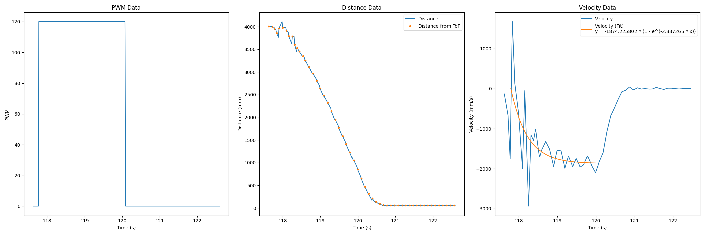
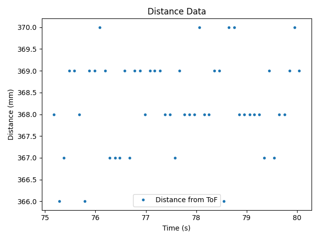
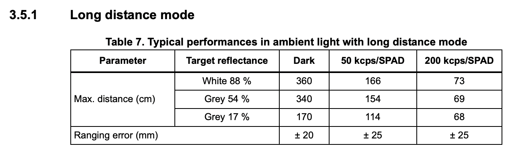
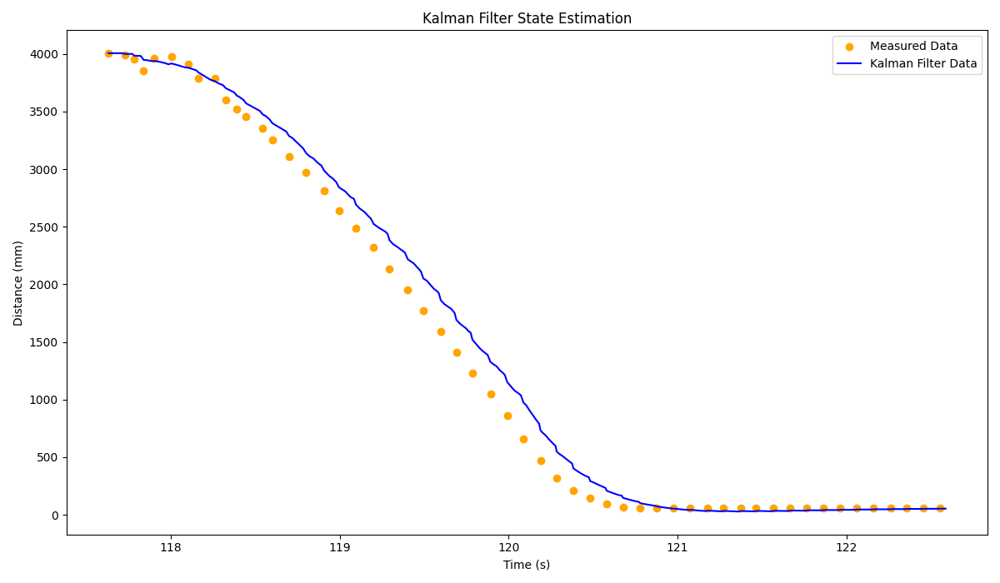
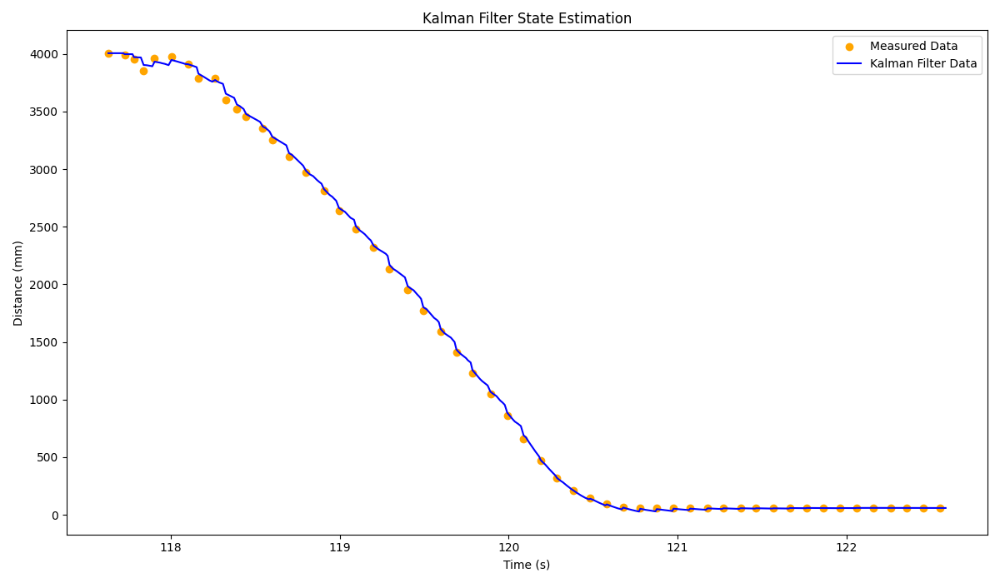
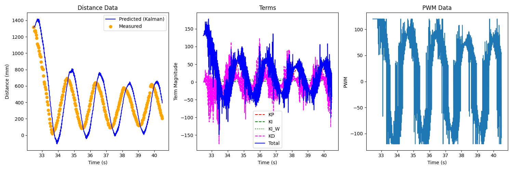
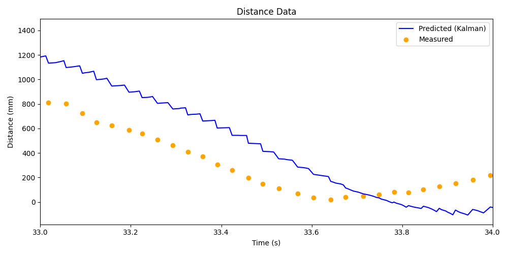
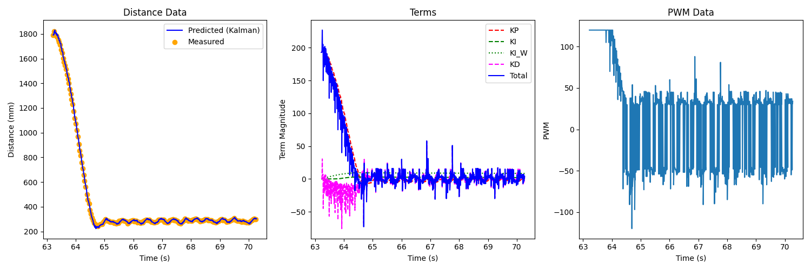
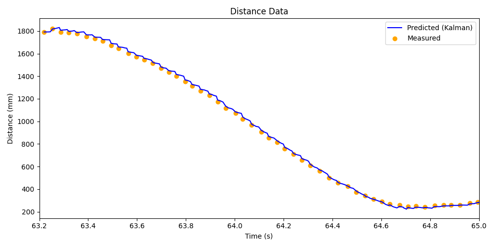

.. ECE 5160 Lab 6 Write-Up: Kalman Filtering

Lab 7: Kalman Filtering
==========================================================================

With our preliminary data, we can now construct a Kalman filter to help
reduce the impact of noise in our sensors

Estimating Drag and Momentum
--------------------------------------------------------------------------

The first thing we needed to do was estimate the drag and momentum of
the car by using a step response and observing the velocity. For this,
I reused my Lab 5 code (using the ToF measurements to get distance),
but replaced the PID controller with a step response sent from Python
(ranging from 0 to 120 PWM, corresponding to stationary and full speed).
From this, we can get the velocity measurements from the distance data;
although somewhat noisy due to sensor and time variance, the data was
clean enough to fit to the expected exponential decay:

Here, the fitted exponential (using the start of the step input as
:math:`x = 0`) is

.. math::

   y = -1874.2258 \cdot \left(1 - e^{-2.3373x}\right)

We can see from the fit that:

* The steady state speed (when :math:`x` is large, so
  :math:`e^{-2.3373x} \rightarrow 0`) is :math:`1874.2258 \frac{mm}{s}`;
  we can visually see that this is where the graph plateaus to
* Accordingly, the 90% rise time speed (90% of steady-state) is
  :math:`0.9 \cdot 1874.2258 = 1686.8032 \frac{mm}{s}`
* The 90% rise time (when :math:`y = -1686.8032`) is reached at
  :math:`x = 0.98516 s`

Taking :math:`u = 1` (a.k.a. 120 is our maximum PWM acceleration),
we can now solve for our drag and mass (taking :math:`v = 0.9` to
represent the 90% velocity, similar to :math:`u`)

.. math::

   d = \frac{u}{\dot x_\text{steady-state}} = \frac{1}{1874.2258 \frac{mm}{s}} \\\\
   \dot v = \frac{u}{m} - \frac{d}{m}v \rightarrow v = 1 - e^{-\frac{d}{m}t_{0.9}} \text{ (from above fit)} \\\\
   m = \frac{-dt_{0.9}}{\ln(1 - 0.9)} = \frac{-0.000533 \cdot 0.98516}{\ln(0.1)} = 0.000228

Initializing the Kalman Filter
--------------------------------------------------------------------------

From here, we can compute our Kalman Filter matrices, starting with our
values above:

.. code-block:: python

   v_ss = 1874.2258
   v_0_9 = 0.9 * v_ss
   t_0_9 = 0.98516

   d = 1 / v_ss
   m = (-1 * d * t_0_9) / math.log(0.1)

From here, we can compute our A and B matrices according to our state-space
equations:

.. math::
   
   \begin{bmatrix}
   \dot x\\
   \ddot x
   \end{bmatrix}
   = A \cdot 
   \begin{bmatrix}
   x\\
   \dot x
   \end{bmatrix}
   + B \cdot u\\\\
   \begin{bmatrix}
   \dot x\\
   \ddot x
   \end{bmatrix}
   = \begin{bmatrix}
   0 & 1\\
   0 & -\frac{d}{m}
   \end{bmatrix} \cdot 
   \begin{bmatrix}
   x\\
   \dot x
   \end{bmatrix}
   + \begin{bmatrix}
   0\\
   \frac{1}{m}
   \end{bmatrix} \cdot u\\\\
   \rightarrow A = \begin{bmatrix}
   0 & 1\\
   0 & -\frac{0.000533}{0.000228}
   \end{bmatrix} = \begin{bmatrix}
   0 & 1\\
   0 & -2.3373
   \end{bmatrix} \text{ (same as exponential fit)}\\\\
   \rightarrow B = \begin{bmatrix}
   0\\
   \frac{1}{0.000228}
   \end{bmatrix} = \begin{bmatrix}
   0\\
   4385.965
   \end{bmatrix}

.. code-block:: python

   A = np.array([[0, 1], [0, -(d / m)]])
   B = np.array([[0], [1 / m]])

To discretize these, we need the sampling rate of our ToF sensor. I
recorded which timestamps of data were valid (shown in the plot above)
to calculate this, similar to previous labs:

.. code-block:: python

  loop_frequency = (len(data_time) - 1) / (data_time[-1] - data_time[0])
  print(f"Loop Frequency: {loop_frequency:>7.6f} Hz")
   
   ready_data_times = []
   for i in range(len(data_time)):
     if( data_ready[i] ):
       ready_data_times.append(data_time[i])

   data_frequency = (len(ready_data_times) - 1) / (ready_data_times[-1] - ready_data_times[0])
   print(f"Data Frequency: {data_frequency:>7.2f} Hz")

.. math::

   \text{Loop Frequency: 98.052231 Hz } (\delta t = 0.01020)\\
   \text{Data Frequency: 10.766541 Hz } (\delta t = 0.09288)

Here, I used the *loop frequency*, as this would be the prediction rate;
the data frequency would be the rate of our updates.

.. code-block:: python

   loop_freq = 98.052231
   dt  = 1 / loop_freq

.. math::

   x(n + 1) = x(n) + \delta t \left(A\cdot x(n) + B\cdot u\right) = \left(I + A \cdot \delta t\right)x(n) + (B \cdot \delta t)u\\\\
   \rightarrow A_d = I + A \cdot \delta t = \begin{bmatrix}
   1 & 0\\
   0 & 1
   \end{bmatrix} + \begin{bmatrix}
   0 & 1\\
   0 & -2.3373
   \end{bmatrix} \cdot 0.01020 = \begin{bmatrix}
   1 & 0.01020\\
   0 & 0.97616
   \end{bmatrix}\\\\
   \rightarrow B_d = B \cdot \delta t = \begin{bmatrix}
   0\\
   4385.965
   \end{bmatrix} \cdot 0.01020 = \begin{bmatrix}
   0\\
   44.7368
   \end{bmatrix}

.. code-block:: python

   A_d = np.eye(2) + (A * dt)
   B_d = B * dt

We also have our C matrix, representing the states we measure (in this
case, only :math:`x`; unlike the guide, I used a positive coefficient
for my positive distance data)

.. math:: 

   C = \begin{bmatrix}
   1\\
   0
   \end{bmatrix}

.. code-block:: python

   C = np.array([
    [1], # distance
    [0]]  # velocity
  )

Lastly, we had to estimate both the *process* and *measurement* noise.
For the former, I used the expressions from lecture to scale with
sampling frequency; for our system, this was :math:`10.767 Hz`:

.. math::
   
   \sigma_x = \sqrt{10^2 \cdot f_\text{data}} = \sqrt{10^2 \cdot (10.767 s^{-1})} = 32.813 mm\\\\
   \sigma_{\dot x} = \sqrt{10^2 \cdot f_\text{data}} = \sqrt{10^2 \cdot (10.767 s^{-1})} = 32.813 \frac{mm}{s}\\\\
   \Sigma_u = \begin{bmatrix}
   \sigma_x^2 & 0\\
   0 & \sigma_{\dot x}^2
   \end{bmatrix} = \begin{bmatrix}
   1076.7 mm^2 & 0\\
   0 & 1076.7 \frac{mm^2}{s^2}
   \end{bmatrix}

For the measurement noise, I initially took a range of stationary distance
measurements to get the standard deviation:

This resulted in :math:`\sigma_\text{noise} = 1.046`; however, this was
significantly less in scale than the others, and would cause the filter
to likely over-prefer sensor measurements. Instead, looking at the
`datasheet <https://www.pololu.com/file/0J1506/vl53l1x.pdf>`_, I chose
:math:`\sigma_\text{noise} = 20`, to match the manufacturer ranging error
for long-distance (our configuration) in ambient light:

.. math::

   \sigma_\text{noise} = 20mm\\\\
   \Sigma_z = \begin{bmatrix}
     \sigma_\text{noise}^2
   \end{bmatrix} = \begin{bmatrix}
     400mm^2
   \end{bmatrix}

We additionally need an initial uncertainty in our state
:math:`\begin{bmatrix}x\\\dot x\end{bmatrix}`; for this, I chose
:math:`\sigma = 20` for the distance (same as our ToF distance
uncertainty), and :math:`\sigma = 1` for our velocity (as we're
certain that we start stationary, but need some small noise).

.. code-block:: python

   data_freq = 10.766541

   sigma_x = math.sqrt(100 * data_freq)
   sigma_xdot = math.sqrt(100 * data_freq)
   sigma_noise = 20

   Sigma_u = np.array([[sigma_x**2, 0], [0, sigma_xdot**2]])  # Process
   Sigma_z = np.array([[sigma_noise**2]])  # Measurement

   sigma = np.array([[20**2, 0], [0, 1**2]])  # Initial state uncertainty

Implementing in Python
--------------------------------------------------------------------------

From here, we could use the given Kalman Filter function to process our
data; I adapted it to only update from our sensor readings if they
are valid:

.. code-block:: python

   def kf(mu, sigma, data_ready, u, y):

       mu_p = A_d.dot(mu) + B_d.dot(u)
       sigma_p = A_d.dot(sigma.dot(A_d.transpose())) + Sigma_u
   
       if data_ready:
           sigma_m = C.dot(sigma_p.dot(C.transpose())) + Sigma_z
           kkf_gain = sigma_p.dot(C.transpose().dot(np.linalg.inv(sigma_m)))
           y_m = y - C.dot(mu_p)
           mu = mu_p + kkf_gain.dot(y_m)
           sigma = (np.eye(2) - kkf_gain.dot(C)).dot(sigma_p)
       else:
           mu = mu_p
           sigma = sigma_p
   
       return mu, sigma

We can use this to iterate through our data (starting from our initial
distance measurement and zero velocity as our state). The only processing
we need to do is to change our motor PWM output to be :math:`-1` when the
motor is on (the full scale of :math:`u`, but decreasing distance), and
:math:`0` when it's off:

.. code-block:: python

   x = np.array([[data_distance[0]], [0]])
   filter_dist = [data_distance[0]]

   for i in range(1, len(data_distance)):
       x, sigma = kf(
           x,
           sigma,
           data_ready[i],
           -1 if (data_motor_pwm[i] == 120) else 0,  # u
           data_distance[i],  # y
       )
       filter_dist.append(x[0][0])

Plotting this data, we can see that it interpolates between measured data
points well:

This filter depends on the *drag* and *mass*, which we determined from
our sample data. However, it also depends on the variance we provided
for our process and sensors; increasing the variance for our sensor
causes our filter to rely more on the model, and vice versa:

.. math::

   \sigma_x, \sigma_{\dot x} = 1, \sigma_\text{noise} = 20 \text{ (relies on model)}

Looking at our first plot, we can see that it is likely overly-reliant on
sensor values (especially at the beginning). To find a good middle ground,
I increased :math:`\sigma_\text{noise}` to :math:`80`, smoothing out the
initial noise while maintaining good estimation:

Implementing on the Robot
--------------------------------------------------------------------------

We can now implement a Kalman Filter on the Artemis using our found
parameters; I did so using an object-oriented model to establish parameters
when initialized, and update when needed (taking the measured distance
on the first valid measurement to initialize state):

.. code-block:: c++
   :class: toggle

   KF::KF() : first_time( true )
   {
     Id      = { 1, 0, 0, 1 };
     float d = 0.000533;
     float m = 0.000228;
   
     BLA::Matrix<2, 2> A = { 0, 1, 0, -d / m };
     BLA::Matrix<2, 1> B = { 0, 1 / m };
   
     float dt = 0.01020;
     A_d      = Id + ( A * dt );
     B_d      = B * dt;
   
     C = { 1, 0 };
   
     float sigma_x, sigma_xdot;
     sigma_x, sigma_xdot = 32.813;
     sigma_u = { sigma_x * sigma_x, 0, 0, sigma_xdot * sigma_xdot };
   
     float sigma_noise = 5;
     sigma_z           = { sigma_noise * sigma_noise };
   
     sigma = { 400, 0, 0, 1 };
   }

   float KF::update( bool data_ready, float u, int distance )
   {
     if ( first_time ) {
       if ( data_ready ) {
         // Initialize state
         state      = { (float)distance, 0.0 };
         first_time = false;
         return distance;
       }
       else {
         return distance;
       }
     }
   
     // Prediction
     BLA::Matrix<2, 1> mu_p    = ( A_d * state ) + ( B_d * u );
     BLA::Matrix<2, 2> sigma_p = ( A_d * sigma * ~A_d ) + sigma_u;
   
     // Update
     if ( data_ready ) {
       BLA::Matrix<1, 1> sigma_m = ( C * ( sigma_p * ( ~C ) ) ) + sigma_z;
       BLA::Matrix<1, 1> sigma_m_inv = sigma_m;
       Invert( sigma_m_inv );
   
       BLA::Matrix<2, 1> kkf_gain = sigma_p * ( ( ~C ) * sigma_m_inv );
       BLA::Matrix<1, 1> y        = { (float)distance };
       BLA::Matrix<1, 1> y_m      = y - ( C * mu_p );
       state                      = mu_p + ( kkf_gain * y_m );
       sigma                      = ( Id - ( kkf_gain * C ) ) * sigma_p;
     }
     else {
       state = mu_p;
       sigma = sigma_p;
     }
   
     return state( 0, 0 );
   }

From here, I integrated this into the ``run_pid_step`` function from
Lab 5, now sourcing distance data from the filter:

.. code-block:: c++

   last_distance_valid = false;

   void run_pid_step()
   {
     bool data_ready;
     if ( tofs.sensor1.checkForDataReady() ) {
       curr_distance = tofs.sensor1.getDistance();
       tofs.sensor1.clearInterrupt();
       tofs.sensor1.stopRanging();
       tofs.sensor1.startRanging();
       data_ready          = true;
       last_distance_valid = true;
     }
     else {
       data_ready = false;
     }
   
     curr_distance_kf = kf.update(
         data_ready, ( (float) last_motor_pwm ) / 120.0, curr_distance );
   
     if ( last_distance_valid ) { // We have a valid measurement
       pid.update( curr_distance_kf );
       curr_total_term = pid.get_control();
       curr_motor_pwm  = pid.scale( curr_total_term );
     }

     // Update motors and log data, same as Lab 5

Running this as-is, I initially got poor performance from poor
distance predictions:

We can see that the robot is overpreferring the model to sensor
readings; while our sigma values may have worked for an ideal step
response, they may not for highly-varying control input. Changing
:math:`\sigma_\text{noise}` to :math:`5` (preferring sensor readings
to the model) yielded good results, with high but not exact reliance
on sensor readings, and a quick and accurate stop with small oscillations:

.. youtube:: 9E7OIQG9cWA
   :align: center
   :width: 70%

Acknowledgements
--------------------------------------------------------------------------

In this lab, I referenced both `Daria's <https://pages.github.coecis.cornell.edu/dak267/dak267.github.io/>`_
and `Mikayla's <https://mikaylalahr.github.io/FastRobotsLabReports/startbootstrap-resume-master/dist/index.html#Lab%207>`_
past implementations, which were helpful in determining the Numpy syntax
for expressing arrays in Python.