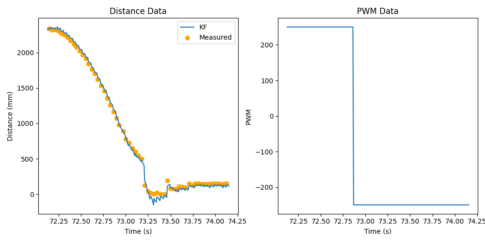
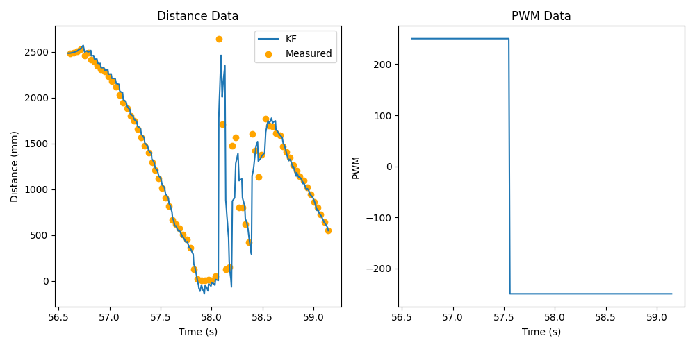
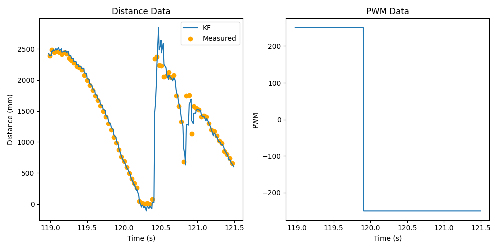
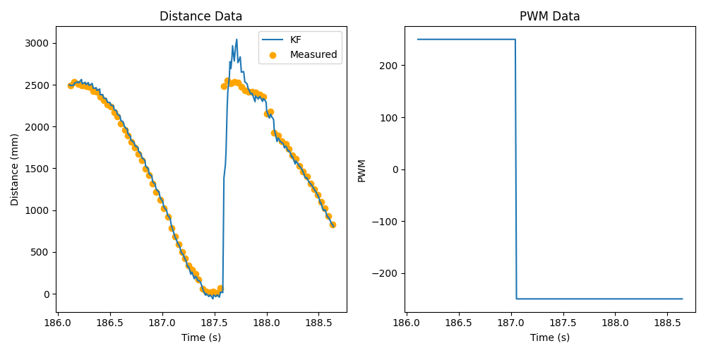

.. ECE 5160 Lab 8 Write-Up: Stunts

Lab 8: Stunts!
==========================================================================

With the high-speed state estimation provided by the Kalman Filter,
we now have enough information to perform a quick stunt. For this lab,
I chose to complete the flip (the cooler stunt, in my opinion).

Flip State
--------------------------------------------------------------------------

I divided the flip into three states; ``IDLE``, ``APPROACHING``, and
``GO_AWAY``:

* The car would start and wait in ``IDLE`` until instructed to perform
  a flip over BLE; at this point, the state changes to ``APPROACHING``.
  In ``IDLE``, the car was stationary.
* When in ``APPROACHING``, we would drive the car forward at full speed.
  Once the distance between the car and the wall became less than 1.2m,
  we progressed to ``GO_AWAY``
* We would remain in ``GO_AWAY`` for 1.5 seconds, at which point we'd
  return to ``IDLE``. In ``GO_AWAY``, the motors would go full speed
  in reverse, to both initiate a flip and go away from the wall.

These state changes were part of a ``flip_step`` function, which was
called from the main loop (resulting in a small latency between loop
iterations). Notice that I re-used the ``Car`` object from Lab 5 to
abstract the pin operations to change the motors, highlighting the
code reusability from C++ classes:

.. code-block:: c++
   :class: toggle

   void flip_step()
   {
     curr_time = millis();
     int curr_distance, curr_motor_pwm;
     float curr_distance_kf;
   
     // Get data when ready
     bool data_ready;
     if ( tofs.sensor1.checkForDataReady() ) {
       curr_distance = tofs.sensor1.getDistance();
       tofs.sensor1.clearInterrupt();
       tofs.sensor1.stopRanging();
       tofs.sensor1.startRanging();
       data_ready          = true;
       last_distance_valid = true;
     }
     else {
       data_ready = false;
     }
   
     // Update our filter
     curr_distance_kf = kf.update(
         data_ready, ( (float) last_motor_pwm ) / 120.0, curr_distance );
   
     // Compute the correct motor action to take
     switch ( curr_state ) {
       case IDLE:
         curr_motor_pwm = 0;
         last_time      = curr_time;
         break;
       case APPROACHING:
         curr_motor_pwm = 250;
         if ( last_distance_valid & ( curr_distance_kf < 1200.0 ) ) {
           curr_state = GO_AWAY;
           last_time  = curr_time;
         }
         break;
       case GO_AWAY:
         curr_motor_pwm = -250;
         if ( curr_time - last_time > 1500 ) {
           curr_state = IDLE;
         }
         break;
       default:
         curr_state = IDLE;
         curr_motor_pwm = 0;
     }
   
     // Execute the action
     if ( curr_motor_pwm > 30 ) {
       car.forward( curr_motor_pwm );
     }
     else if ( curr_motor_pwm < -30 ) {
       car.backward( -1 * curr_motor_pwm );
     }
     else {
       car.stop();
     }
     last_motor_pwm = curr_motor_pwm;

     // Log the data - shown below:
   }

The state was also modified in our BLE ``switch`` statement with
the ``RUN_FLIP`` command (to transition to the ``APPROACHING`` state):

.. code-block:: c++

   // In `handle_command`
   case RUN_FLIP:
      reset_data();
      curr_state = APPROACHING;
      break;

Lastly, I also re-used the code from Labs 5 - 7 to log the data in
``flip_step``, and use the BLE command ``GET_DATA`` to send it to
Python:

.. code-block:: c++

   // In `flip_step`
   if ( last_distance_valid & (
      curr_state == APPROACHING || curr_state == GO_AWAY
   ) ) {
     log_pid_data( curr_time, data_ready, curr_distance, curr_distance_kf,
                   curr_motor_pwm );
   }

   // In `handle_command`

   case GET_DATA:
      Serial.printf( "Getting data...(%d)\n", entry_idx );
      for ( int i = 0; i < entry_idx; i++ ) {
        tx_estring_value.clear();
        tx_estring_value.append( time_entries[i] );
        tx_estring_value.append( "|" );
        tx_estring_value.append( (int) data_ready_entries[i] );
        tx_estring_value.append( "|" );
        tx_estring_value.append( distance_entries[i] );
        tx_estring_value.append( "|" );
        tx_estring_value.append( dist_kf_entries[i] );
        tx_estring_value.append( "|" );
        tx_estring_value.append( motor_pwm_entries[i] );
        tx_characteristic_string.writeValue( tx_estring_value.c_str() );
      }
      break;

I initially included PID control after the flip to correct the angle;
however, I experimentally found that this wasn't needed, and introduced
significant additional complexity that slowed down the main loop
(getting yaw data, updating the PID controller, and determining how
to use the output to correct the motors, including checking whether
we've flipped yet), so I omitted it from the final version.

Demonstrations
--------------------------------------------------------------------------

For my initial attempts to get Ned to flip, I increased the weight on the
front by adding a 9V battery, to make flipping easier:

.. image:: img/lab8/initial_setup.png
   :align: center
   :width: 75%
   :class: bottompadding

This was able to yield a successful attempt:

Flip 1
""""""""""""""""""""""""""""""""""""""""""""""""""""""""""""""""""""""""""

.. youtube:: w4R_UrnrXuQ
   :align: center
   :width: 70%

However, performing flips in this state was unreliable:
 - The 9V battery was bulky enough to often become dislodged during
   the flip
 - The wheels often slipped, losing the traction needed to execute the
   flip

To fix these issues:
 - I replaced the 9V batter with two smaller AA batteries
 - I added duct tape on the front wheels (the ones the flip occurred on).
   However, this resulted in *too*
   much traction, so I scuffed them up with dirt from the corner
   of the lab

.. image:: img/lab8/final_setup.png
   :align: center
   :width: 75%
   :class: bottompadding

This approach (while slightly more gross) yielded significantly
more reliable results:

Flip 2
""""""""""""""""""""""""""""""""""""""""""""""""""""""""""""""""""""""""""

.. youtube:: 6W5-oA1L8Ow
   :align: center
   :width: 70%

*(The jitters are likely from detecting the ground)*

Flip 3
""""""""""""""""""""""""""""""""""""""""""""""""""""""""""""""""""""""""""

.. youtube:: 30oWMuTZDss
   :align: center
   :width: 70%

Flip 4
""""""""""""""""""""""""""""""""""""""""""""""""""""""""""""""""""""""""""

.. youtube:: z9u9YH1KIsg
   :align: center
   :width: 70%

Notice from the plots that we start reversing significantly before the
actual flip occurs; this is due to loss of traction. The Kalman filter
estimations also significantly degrade after the flip, as our distance
sensor has changed location.

Bloopers
--------------------------------------------------------------------------

In this trial-and-error process, some funny unsuccessful runs were
inevitable. Enjoy!

Sideways Flip
""""""""""""""""""""""""""""""""""""""""""""""""""""""""""""""""""""""""""

.. youtube:: yLJOJ6_7atA
   :align: center
   :width: 70%

... the Double?
""""""""""""""""""""""""""""""""""""""""""""""""""""""""""""""""""""""""""

.. youtube:: INF7b5LLBTU
   :align: center
   :width: 70%

... the TRIPLE?
""""""""""""""""""""""""""""""""""""""""""""""""""""""""""""""""""""""""""

.. youtube:: YktmBchx_TA
   :align: center
   :width: 70%

Standing Up (???)
""""""""""""""""""""""""""""""""""""""""""""""""""""""""""""""""""""""""""

.. youtube:: J_FQEcU9euw
   :align: center
   :width: 70%