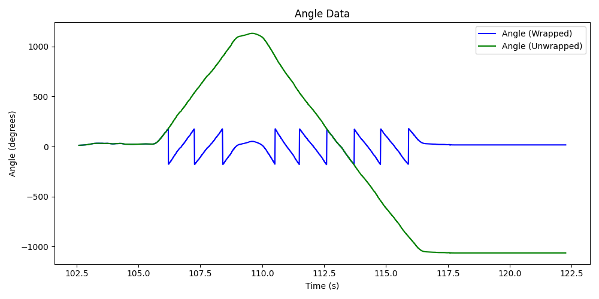
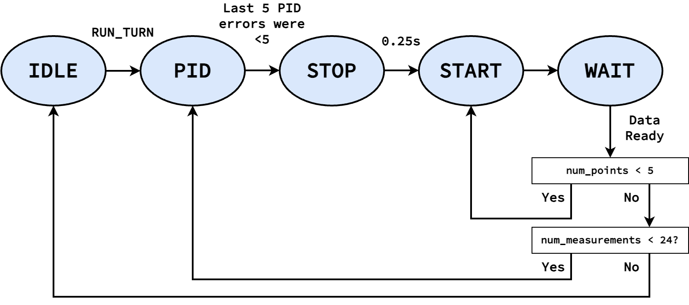

.. ECE 5160 Lab 9 Write-Up: Mapping

Lab 9: Mapping
==========================================================================

This lab focused on combining many previous components to map an obstacle
setup in the lab, including using a PID controller to achieve a specific
angle, as well as the ToF sensor to measure the distance at that angle

Angle Wrapping
--------------------------------------------------------------------------

For this lab, I re-used my DMP object from Lab 6 to obtain a low-noise
angle measurement for our yaw. However, the DMP only reports its angle
in the range :math:`-180^\circ` to :math:`180^\circ`. If we fed this
directly into our PID controller,
and tried to achieve a set point of :math:`180^\circ`, it might overshoot
a bit, see an angle of :math:`-180^\circ`, and suddenly have a high error
to keep going instead of reversing, resulting in the car spinning.

To avoid this, I created a function that checked the last reported angle,
and used that to "correct" our current angle to avoid wrapping. I kept
track of the number of "wraps" (overshoots by :math:`360^\circ`), as well as
the last reported angle.

* We first correct our angle by checking if there was a large difference
  between our last angle and the current (if the last angle was largely
  positive, in this case beyond :math:`90^\circ` in magnitude, but our current angle
  is the opposite sign, we most likely overflowed)
* We then correct based on the number of "wraps" that already took place

.. code-block:: c++

   double last_wrap_angle = 0;
   int    num_wraps = 0;

   // Take a "wrapped" angle and return an "unwrapped" angle
   double angle_no_wrap( double curr_angle )
   {
     // Adjust angle based on last angle
     if (( curr_angle < 0 ) && ( last_wrap_angle > 90 )) {
       // Overflow
       curr_angle = curr_angle + 360;
     }
     else if (( curr_angle > 0 ) && ( last_wrap_angle < -90 )) {
       // Underflow
       curr_angle = curr_angle - 360;
     }
   
     // Adjust angle based on wrapping
     if( num_wraps > 0 ){
       for( int i = 0; i < num_wraps; i++ ){
         curr_angle = curr_angle + 360;
       }
     } else if( num_wraps < 0 ){
       for( int i = 0; i > num_wraps; i-- ){
         curr_angle = curr_angle - 360;
       }
     }
   
     // Update last angle and wrapping
     last_wrap_angle = curr_angle;
     num_wraps = 0;
     while( last_wrap_angle > 180 ){
       num_wraps++;
       last_wrap_angle -= 360;
     }
     while( last_wrap_angle < -180 ){
       num_wraps--;
       last_wrap_angle += 360;
     }
     return curr_angle;
   }

This yielded an angle reading that didn't suffer from wrapping within
the range :math:`[-180^\circ, 180^\circ)`, allowing our PID controller
to function well:

.. youtube:: SjqVC8BoJ8s
   :align: center
   :width: 70%

State Machine
--------------------------------------------------------------------------

From here, Ned needed to continuously rotate and obtain distance
measurements at a series of angles. I chose to obtain 24 measurements
(resulting in :math:`15^\circ` increments), and utilized a state machine
to perform them:

This state machine is encapsulated in the ``measure_step`` function,
which is run from the main loop:

.. code-block:: c++

   void measure_step()
   {
     curr_time = millis();
     switch ( curr_state ) {
       case IDLE:
         ...
         break;
       case PID:
         ...
         break;
       case STOP:
         ...
         break;
       case WAIT:
         ...
         break;
       default:
         break;
     }
   }

   // In `main`...
   while ( central.connected() ) {
     // Send data
     write_data();

     // Read data
     read_data();

     // Update dmp
     dmp.update();
     
     measure_step();
   }

``IDLE``
""""""""""""""""""""""""""""""""""""""""""""""""""""""""""""""""""""""""""

This is our stating state; once we receive the BLE command ``RUN_TURN``,
we start gathering measurements by moving to ``PID``. Here, we only
reset our wrapping and number of collected measurements.

.. code-block:: c++

   case IDLE:
     last_wrap_angle  = 0;
     num_wraps        = 0;
     num_measurements = 0;
     break;

   // In `handle_command`
   case RUN_TURN:
      reset_map_data(); // Reset our mapping data
      start_pid();      // Reset our set point to our current angle
      curr_state = PID;
      break;

``PID``
""""""""""""""""""""""""""""""""""""""""""""""""""""""""""""""""""""""""""

This is where we use our PID controller to achieve the setpoint angle;
this is very similar to Lab 6, except using our unwrapped angle (though
still logging the wrapped angle for absolute yaw)

To know when we've achieve the angle, the last 5 PID errors (a.k.a.
difference between our current and desired angle)
are stored; when they're all sufficiently small (I used :math:`< 5`),
we stop the car, log the time, and move to ``STOP``

.. code-block:: c++
   :class: toggle

   double last_angles[5];
   bool   run_pid_step()
   {
     int   curr_motor_pwm;
     float curr_kp_term, curr_ki_term, curr_ki_windup, curr_kd_term,
         curr_total_term;
     double curr_angle;
   
     bool      data_ready;
     dmp_msg_t dmp_msg = dmp.yaw();
     curr_angle        = dmp_msg.angle;
     data_ready        = dmp_msg.new_data;
     if ( data_ready ) {
       last_angle_valid = true;
     }
   
     bool   pid_done;
     double pid_angle;
     if ( last_angle_valid ) {
       pid_angle = angle_no_wrap( curr_angle );
       pid.update( pid_angle );
       curr_total_term = pid.get_control();
       curr_kp_term    = pid.terms.kp_term;
       curr_ki_term    = pid.terms.ki_term;
       curr_ki_windup  = pid.terms.ki_windup_term;
       curr_kd_term    = pid.terms.kd_term;
       curr_motor_pwm  = pid.scale( curr_total_term );
   
       last_angles[4] = last_angles[3];
       last_angles[3] = last_angles[2];
       last_angles[2] = last_angles[1];
       last_angles[1] = last_angles[0];
       last_angles[0] = pid_angle;
   
       pid_done = true;
       for ( int i = 0; i < 5; i++ ) {
         if ( abs( last_angles[i] - pid.get_setpoint() ) > 5 ) {
           pid_done = false;
         }
       }
       if ( curr_motor_pwm > 0 ) {
         car.right( curr_motor_pwm );
       }
       else {
         car.left( -1 * curr_motor_pwm );
       }
       log_pid_data( curr_time, pid.get_setpoint(), data_ready, curr_angle,
                     curr_kp_term, curr_ki_term, curr_ki_windup,
                     curr_kd_term, curr_total_term, curr_motor_pwm );
     }
     else {
       pid_done = false;
     }
     return pid_done;
   }

.. code-block:: c++

   case PID:
      if ( run_pid_step() ) { // We've achieve the angle
        car.stop();
        stop_time  = millis();
        curr_state = STOP;
      }
      break;

``STOP``
""""""""""""""""""""""""""""""""""""""""""""""""""""""""""""""""""""""""""

I noticed that the car needs some time to physically stop before starting
ranging on our ToF distance sensor (or else the data will be noisy).
Accordingly, ``STOP`` waits for a quarter-second before moving on to
``START``

.. code-block:: c++
   
   case STOP:
      if ( curr_time - stop_time > 250 ) {
        curr_sate = START;
        num_points = 0;
      }
      break;

``START``
""""""""""""""""""""""""""""""""""""""""""""""""""""""""""""""""""""""""""

In ``START``, we start ranging to obtain a measurement, then move on to
``WAIT`` to get the result

.. code-block:: c++

   case START:
      tofs.sensor1.startRanging();
      curr_state = WAIT;
      break;

``WAIT``
""""""""""""""""""""""""""""""""""""""""""""""""""""""""""""""""""""""""""

Finally, ``WAIT`` waits for the distance measurement. Here, we get the
average of 5 data points; if we don't have 5 data points, we go back to
``START``. If we do, we log both the average distance
and the current angle (using the same data logging framework from before).

Once we have the data point, we need to check whether we need to capture
more data (a.k.a. we have fewer than 24 measurements). If so, we increment
the set point (not worrying about wrapping from our handling above), and
return to ``PID``. Otherwise, our job is done, and we return to ``IDLE``

.. code-block:: c++

   case WAIT:
      if ( tofs.sensor1.checkForDataReady() ) {
        data_points[num_points++] = tofs.sensor1.getDistance();
        if ( num_points < 5 ) {
          curr_state = START;
        }
        else {
          int avg_distance =
              ( data_points[0] + data_points[1] + data_points[2] +
                data_points[3] + data_points[4] ) /
              5;
          log_map_data( curr_time, dmp.yaw().angle, avg_distance );
          num_measurements++;
          if ( num_measurements < 24 ) {
            pid.set_setpoint( pid.get_setpoint() + 15 );
            curr_state = PID;
          }
          else {
            stop_pid();
            curr_state = IDLE;
          }
        }
      }
      break;

Post-Processing
--------------------------------------------------------------------------

Once the data's been collected it, we can transfer it back to Python,
similar to before with a BLE command ``GET_ANGLE_DATA``

.. code-block:: c++
   :caption: Artemis code for transferring data

   // In `handle_command`
   case GET_ANGLE_DATA:
      Serial.printf( "Getting data (%d)...\n", data_entry_idx );
      for ( int i = 0; i < data_entry_idx; i++ ) {
        tx_estring_value.clear();
        tx_estring_value.append( data_time_entries[i] );
        tx_estring_value.append( "|" );
        tx_estring_value.append( data_yaw_entries[i] );
        tx_estring_value.append( "|" );
        tx_estring_value.append( data_distance_entries[i] );
        tx_characteristic_string.writeValue( tx_estring_value.c_str() );
        Serial.printf( "Sending data %d...\n", i );
      }
      break;

.. code-block:: python
   :caption: Python code for receiving data

   data_time = []
   data_yaw = []
   data_distance = []
   NUM_SAMPLES = 24
   i = 0
   
   def parse_angle_data( data: str ):
     data_components = data.split("|")
     time       = (float(data_components[0]) / 1000)      # Convert to seconds
     yaw        = float(data_components[1]) * np.pi / 180 # Convert to radians
     distance   = float(data_components[2])
     return time, yaw, distance
   
   def angle_data_handler(_uid, response):
     global i
     time, yaw, distance = parse_angle_data(response.decode())
     data_time_motor.append(time)
     data_yaw.append(yaw)
     data_distance.append(distance)
     i = i + 1
     print(f"{i * 100 / NUM_SAMPLES:.2f}% done", end = '\r')
   
   ble.start_notify(ble.uuid['RX_STRING'], angle_data_handler)
   ble.send_command(CMD.GET_ANGLE_DATA, "")

Once in Python, there are a few steps we need to do to make the data
usable:

* **Convert to 0 - 360**: To get a good plot, we'll subtract the initial
  angle from all measurements to be on the range :math:`0^\circ - 360^\circ`
  (always starting our robot facing in the same direction at the start)

.. code-block:: python

   initial_yaw = data_yaw[0]
   for i in range(len(data_yaw)):
       data_yaw[i] = data_yaw[i] - initial_yaw

* **Account for sensor distance**: Our distance measurements are offset
  from the center of the car (where we rotate), so we need to add this
  back in (I measured 75mm). I also used this to convert our measurements
  to meters

.. code-block:: python

   for i in range(len(data_distance)):
       data_distance[i] += 75
   
       # Convert to meters instead of mm
       data_distance[i] = data_distance[i] / 1000

* **Convert to world frame**: Right now, we have angles and distances,
  but we want global points. Knowing the point that our robot was placed
  at, we can use the sine and cosine of our angles (multiplied by the
  corresponding distance) to compute the global point from our position.

.. code-block:: python

   from math import sin, cos
   curr_point = np.array([-3, -2])
   
   data_global = []
   for i in range(len(data_distance)):
       curr_angle = data_yaw[i]
       translation = np.array([data_distance[i] * cos(curr_angle), data_distance[i] * -1 * sin(curr_angle)])
       data_global.append(curr_point + translation)

   data_x = [point[0] for point in data_global]
   data_y = [point[1] for point in data_global]

.. admonition:: Sine Term sign
   :class: info

   Note that I flip the sign of the sine term; this is because yaw increases
   going into the ground, but our top-down world frame assumes it increases
   rotating out of the ground

From here, we're left with usable x-y coordinate pairs to plot

Mapping the Lab
--------------------------------------------------------------------------